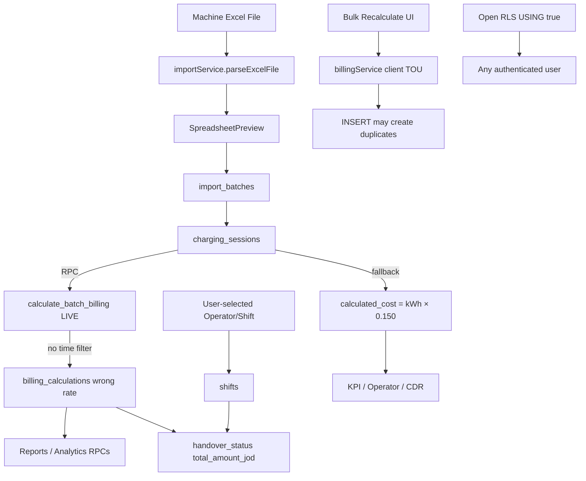
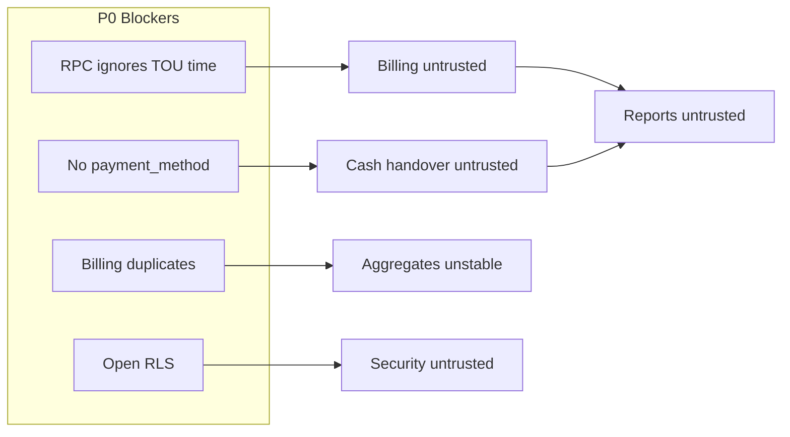
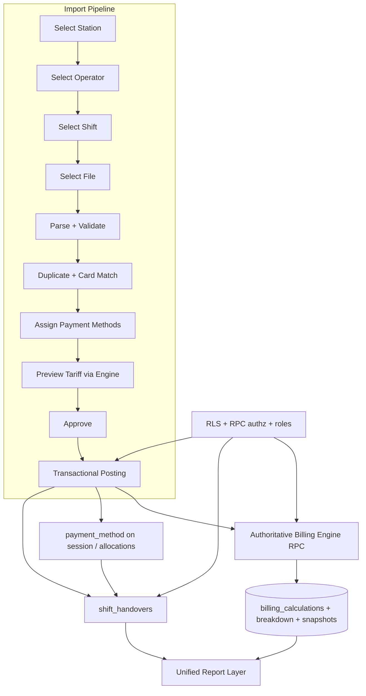

# EV Charging System — Correction and Enhancement Master Plan

**Plan Date:** Thursday, 16 July 2026  
**Author:** Cursor Planning Agent  
**Repository:** `C:\dev\EV-DR\EV-Daily-Report`  
**Status:** Planning only — awaiting Sameer’s approval  
**Inputs used:** Full repository, 17 SQL migrations, generated Supabase types, existing audit report, live database read-only inspection (RPC bodies, tariffs, RLS, operators, billing duplicate counts), and every file currently in `sample files\`

---

## 1. Executive Summary

### Current condition

The application is an operational EV daily-report system (React + Vite + Supabase) used for manual import of machine Excel files, shift assignment, billing, handover, and reporting. Core import and client-side Time-of-Use (TOU) splitting exist, but **production financial trust is broken**.

Verified production facts (live DB, read-only):

| Fact | Value |
|---|---|
| Charging sessions | 84,306 |
| Sessions with billing flag | 84,306 |
| Sessions with duplicate `billing_calculations` | **236** |
| Active tariff periods | Off-Peak / Mid-Peak / PEAK / MID (times match confirmed government schedule) |
| `demand_charge_per_kw` on active periods | Incorrectly set equal to energy rates (0.183 / 0.193 / 0.213) |
| RLS on core tables | Fully open (`USING (true)` / `WITH CHECK (true)`), with duplicate policies |
| Missing from migrations | `calculate_batch_billing`, `delete_import_batch`, `recalculate_shift_totals`, `recalculate_all_shift_totals`, and most base CREATE TABLE definitions |

### Confirmed root cause of the 0.183 import defect

Live `calculate_batch_billing` **does not filter rate periods by time of day**. It selects:

```sql
ORDER BY rp.priority DESC
LIMIT 1
```

All current periods have `priority = 1`, so the RPC effectively picks an arbitrary period — commonly Off-Peak `0.183` — for every session. It also embeds a hardcoded fallback rate of `0.150` when no rate structure exists. This matches observed import behavior and supersedes earlier audit inferences that only guessed at the RPC body.

The client-side engine in `billingService.ts` does perform correct half-open TOU splitting and proportional energy allocation, which is why Bulk Recalculate appears to “fix” billing.

### Confirmed business decisions already locked for this plan

- Four government energy periods only (Demand Charge removed from active Jordan billing)
- Tax = 0 for Jordan EV charging workflow
- Payment methods: Cash / Card / CliQ
- Operator is user-selected (not roster-derived); file card ID must be validated against selected operator
- Timezone: `Asia/Amman`
- Overnight / next-day timestamps must be first-class
- Bulk Recalculate remains an authorized correction tool only — not a required step after successful import

### Main production blockers

1. Import-time billing RPC ignores TOU time windows (systematic wrong rates)
2. No payment method → cash handover cannot be correct
3. Duplicate billing rows still present; no UNIQUE on `session_id`
4. Open RLS + client-only RBAC
5. Revenue sources inconsistent (`billing_calculations` vs `calculated_cost` fallback 0.150)
6. Tariff timeline cannot render overnight MID (`23:00–05:00`)
7. Zero automated tests

### Recommended minimum phase count

**6 major phases (A–F)** — see §17.

### Recommended implementation order

1. **Phase A** — Safety, RPC capture, billing uniqueness, baseline security  
2. **Phase B** — Authoritative tariff/billing engine, Demand Charge retirement, tax=0, timeline fix  
3. **Phase C** — Import workflow hardening (operator/card, idempotency, posting, preview)  
4. **Phase D** — Payment methods + handover finalization  
5. **Phase E** — Reports / KPI / Excel / PDF reconciliation  
6. **Phase F** — Full automated tests, UAT on new sample files, controlled historical correction, release

**First phase after approval: Phase A.**

---

## 2. Confirmed Scope

| In scope | Out of scope / deferred |
|---|---|
| Daily machine-file import correction | Live OCPP activation |
| Government TOU tariff engine | Changing live tariff rows during planning |
| Billing calculation + auditability | Production import of the two new sample files during planning |
| Cash / Card / CliQ | Automatic historical recalculation without Sameer’s approval |
| Operator cash handover | Deleting OCPP tables/migrations now |
| Reports and reconciliation | Multi-country tax engines |
| Security / RLS / roles | Redesigning unrelated analytics charts for aesthetics |
| Testing and UAT | Building a separate Node API server (not required) |
| Historical correction *strategy* | Immediate destructive column drops without deprecate path |

OCPP remains deferred and isolated: DB tables exist; `src/` has zero OCPP runtime code.

---

## 3. Confirmed Business Rules

### 3.1 Tariff periods (active Jordan government TOU)

| Period | Time (half-open) | Energy Rate |
|---|---|---:|
| Off-Peak | 05:00–14:00 | 0.183 JOD/kWh |
| Mid-Peak | 14:00–17:00 | 0.193 JOD/kWh |
| Peak | 17:00–23:00 | 0.213 JOD/kWh |
| MID | 23:00–05:00 | 0.193 JOD/kWh |

Rules:

- Exactly one active tariff structure covering every minute of the day
- Half-open intervals: start inclusive, end exclusive
- Examples: 05:00 Off-Peak; 14:00 Mid-Peak; 17:00 Peak; 23:00 MID; 00:00 MID
- Duplicate `MID-PEAK 2` will be removed manually by Sameer (live active structure already shows a single MID overnight period)

### 3.2 Billing formula

```text
Energy Charge = Energy Consumed (kWh) × Applicable Government Energy Rate (JOD/kWh)
Tax = 0
Demand Charge = not used (must be zero / retired)
```

### 3.3 Operational workflow

1. Officer downloads machine file  
2. One file normally = one operator + one shift  
3. User selects station, operator, shift  
4. File supplies transactions + operator card ID  
5. Filename may imply operator name  
6. Operator is **not** derived from roster  
7. System validates, assigns payment methods, previews tariff/billing, then posts transactionally  
8. System applies correct tariff automatically  
9. System computes operator physical cash responsibility from Cash only  
10. Card and CliQ are displayed but excluded from physical cash handover  

### 3.4 Timezone and overnight

- Canonical zone: `Asia/Amman`
- Sessions may start on day N and finish on day N+1
- Duration must never be negative
- Finish date must never be silently collapsed onto start date
- Date filters must use full timestamps

### 3.5 Cross-period rule (recommendation pending approval)

| Item | Classification |
|---|---|
| Current client engine | **Confirmed fact:** proportional duration split of total energy |
| Sample files | Provide total session energy only (no interval meters) |
| Option A — Start-time tariff | Simpler; legally clear if contracts say “rate at start” |
| Option B — Proportional duration split | Matches current correct client engine; estimates when power varies |
| **Recommendation** | Keep **Option B**, version the rule as `billing_engine_version`, and require Sameer’s explicit approval before lock-in |
| Same overnight period across midnight | Do **not** invent two charges merely because the calendar date changes if the period and tariff version are unchanged |

---

## 4. New Sample File Analysis

### 4.1 Files present in `sample files\` (16 July 2026)

| Filename | Status | Operator (filename) | Card ID | Rows | Total energy (kWh) |
|---|---|---|---|---:|---:|
| `2026-07-16+abo saleh.xlsx` | **New (not previously imported for this plan)** | ABO SALEH | `2024040000006424` | 59 | 781.300 |
| `2026-07-16+mohammad.xlsx` | **New (not previously imported for this plan)** | MOHAMMAD | `2024040000006443` | 83 | 1,219.800 |

Both files:

- Sheet: `Transaction(JOD)`
- Identical columns to prior samples (Transaction ID, Charge Point ID, Connector, Card Number, Start/Stop Time, Duration, Energy, CO₂, Start/End SOC)
- **No** Cost / Amount / Payment Method columns
- Timestamps include `(UTC+03:00)` Jordan offset
- Intra-file duplicate Transaction IDs: **none**
- Invalid durations / negative energy / missing required fields: **none**

Live operator master match (**confirmed fact**):

| File card | Operator record |
|---|---|
| `2024040000006424` | ABO SALEH ALI SALEH (active) |
| `2024040000006443` | MOHAMMAD DARWESH (active) |

### 4.2 Prior sample files (from audit; currently under `ignored files\`)

| Filename | Rows | Card | Notes |
|---|---:|---|---|
| `2026-06-24+MOHAMMAD.xlsx` | 74 | 6443 | Mid-Peak afternoon cluster |
| `2026-06-27+MOHAMMAD.xlsx` | 78 | 6443 | Same |
| `2026-06-29+ABO SALEH.xlsx` | 87 | 6424 | Same |
| `2026-07-01+MOHAMMAD.xlsx` | 89 | 6443 | NaN SOC marker present |

These remain useful regression fixtures but are **not** the fresh-import UAT set.

### 4.3 `2026-07-16+abo saleh.xlsx` detail

| Attribute | Value |
|---|---|
| Start range | 2026-07-15 23:37:55 → 2026-07-16 08:02:59 |
| Stop range | 2026-07-15 23:45:05 → 2026-07-16 08:20:25 |
| Start-period distribution | MID 45, Off-Peak 14 |
| Midnight crossings | **1** |
| Tariff boundary crossings (multi-period) | 0 |
| NaN / `----` SOC markers | 16 fields across 16 rows |
| Charge points seen | `244901000005/006/007/010/011/012`, `244801000001/002` |

**Midnight / overnight session (critical UAT):**

| Transaction ID | Start | Stop | Energy | Expected |
|---|---|---|---:|---|
| `1573323579` | 2026-07-15 23:53:32 | 2026-07-16 00:37:05 | 38.000 | Entirely MID @ 0.193; duration ≈ 43.55 min; no negative duration; finish date 16 Jul |

Representative MID / Off-Peak IDs:

- MID: `713470532`, `949651742`, `1416356524`, `415983524`
- Off-Peak: `394824286`, `66293539`, `704185309`, `1694437243`

### 4.4 `2026-07-16+mohammad.xlsx` detail

| Attribute | Value |
|---|---|
| Start range | 2026-07-16 08:25:30 → 2026-07-16 15:39:35 |
| Stop range | 2026-07-16 08:46:01 → 2026-07-16 15:57:28 |
| Start-period distribution | Off-Peak 57, Mid-Peak 26 |
| Midnight crossings | 0 |
| Off-Peak → Mid-Peak crossings | **6** |
| NaN / `----` SOC markers | 16 fields |
| Charge points | includes `244901000001` plus shared IDs above |

**Boundary-crossing UAT IDs (Off-Peak → Mid-Peak at 14:00):**

| Transaction ID | Start | Stop | Energy (kWh) | Periods |
|---|---|---|---:|---|
| `1409778499` | 13:59:17 | 14:14:44 | 8.200 | Off-Peak + Mid-Peak |
| `1613808371` | 13:50:07 | 14:00:22 | 10.900 | Off-Peak + Mid-Peak |
| `445488588` | 13:49:18 | 14:01:54 | 8.200 | Off-Peak + Mid-Peak |
| `1201532186` | 13:48:51 | 14:03:40 | 16.600 | Off-Peak + Mid-Peak |
| `696086752` | 13:27:14 | 14:13:45 | 34.500 | Off-Peak + Mid-Peak |
| `2046279491` | 13:15:07 | 14:27:04 | 38.200 | Off-Peak + Mid-Peak |

Example expected calculation under Option B for `1613808371` (10.25 min total ≈ 9.88 min Off-Peak + 0.37 min Mid-Peak):

```text
Off-Peak energy ≈ 10.900 × (9.883 / 10.25)
Mid-Peak energy ≈ 10.900 × (0.367 / 10.25)
Amount = e1×0.183 + e2×0.193  (rounded to 3 dp JOD)
```

### 4.5 Sample-file planning rules

- **Do not import these two new files into production during planning**
- Use only disposable / approved test environments for fresh-import UAT
- Retain original files, checksums, and row counts as UAT gold fixtures
- After Phase C/D, re-run the same Transaction IDs for tariff, payment, handover, and report reconciliation

---

## 5. Current Architecture and Defect Dependency Map





### Defect dependency notes

| Defect | Blocks |
|---|---|
| Missing RPC SQL in migrations | Reproducible environments, safe replacement |
| Duplicate billing rows | UNIQUE constraint, analytics correctness |
| Wrong import RPC | Automatic tariff at import, trust of 84k billed sessions |
| Client timezone via `Date.getHours()` | Correct TOU if browser ≠ Amman |
| Demand charge still computed | Jordan energy-only rule |
| No payment method | Handover formula, cash discrepancy reports |
| Open RLS | Any later permission matrix |
| Split revenue sources | Screen = Dashboard = Excel = PDF |

---

## 6. Target Architecture



### Authoritative billing engine recommendation

| Option | Fit | Verdict |
|---|---|---|
| 1. PostgreSQL RPC / DB function | Matches current import posting; transactional; cannot be bypassed by client | **Recommended authority** |
| 2. Supabase Edge Function | Extra deploy surface; still needs DB writes under RLS | Not preferred |
| 3. Trusted app backend | No existing Node API in this repo | Reject for now |
| 4. Client-side only | Already has correct TOU logic but timezone bugs; bypassable; caused dual-path mess | Preview / unit-test mirror only |

**Recommendation (confirmed architecture choice for this plan):**

- Make a corrected PostgreSQL function the **single authority** for persisted billing
- Port the proven client split/allocate algorithm into SQL with explicit `Asia/Amman`
- Keep a TypeScript pure calculator for unit tests and import preview, asserting parity against the RPC
- Bulk Recalculate and import posting both call the same RPC
- Persist: tariff structure id, period ids, applied rates, engine version, calculated_at

---

## 7. Tariff and Time Handling Design

### 7.1 24-hour coverage validation

Before a rate structure can be activated:

1. Normalize all periods to minute-of-day half-open intervals
2. Expand overnight periods into logical coverage spanning midnight
3. Reject gaps
4. Reject overlaps
5. Require season/`all` rules that still cover every minute for every applicable day

### 7.2 Half-open boundaries

| Instant | Period |
|---|---|
| 04:59:59 | MID |
| 05:00:00 | Off-Peak |
| 13:59:59 | Off-Peak |
| 14:00:00 | Mid-Peak |
| 16:59:59 | Mid-Peak |
| 17:00:00 | Peak |
| 22:59:59 | Peak |
| 23:00:00 | MID |
| 23:59:59 | MID |
| 00:00:00 | MID |

### 7.3 Overnight timeline UI

**Current behavior (confirmed):** `RatePeriodEditor.timeToPercent` computes:

```text
left = start/1440*100
width = (end - start)/1440*100
```

For MID `23:00–05:00`, width is **negative** (−75%), so the block does not render as a valid overnight segment and can overflow/clip depending on browser layout.

**Target:**

- Store one logical DB period (`23:00–05:00`)
- Render as two visual segments linked to the same `rate_period.id`:
  - `23:00–24:00`
  - `00:00–05:00`
- Shared utility: `src/lib/tariffIntervalUtils.ts` (new) used by editor + any preview
- Never position beyond hour 24
- Show gaps/overlaps + complete-coverage indicator
- Keyboard / a11y preserved
- Template preview and editable timeline use identical rendering

### 7.4 Next-day session logic

| Case | Required behavior |
|---|---|
| 23:40 Day1 → 00:30 Day2 | Duration 50 min; both in MID; one MID charge unless tariff version changes at midnight |
| 04:50 → 05:10 | Cross MID → Off-Peak; apply approved cross-period rule |
| 22:50 → 23:10 | Cross Peak → MID at 23:00 |
| 13:50 → 17:10 | Off-Peak + Mid-Peak + Peak segments |
| Stop == Start | Reject |
| Stop < Start (true) | Reject (do not auto-add a day unless machine format proves date omission — current files already include dates) |
| Missing timezone | Reject or normalize only when file suffix `(UTC+03:00)` / explicit offset present |
| > 24 h | Reject or quarantine as exception |
| Month/year end overnight | Same rules; covered by timestamptz |

### 7.5 Shift-date convention (**recommendation**)

**Recommendation:** `shift_date` = calendar date of the **user-selected shift start** in `Asia/Amman` (current create-shift behavior). Overnight sessions remain on that shift via `shift_id`, even if `end_ts` is next calendar day. Daily reports aggregate by `shift_date` for operational handover and by `start_ts`/`end_ts` filters for energy timelines — definitions must be labeled in UI.

**Business decision still required:** confirm this convention (Decision Register RD-01).

### 7.6 Effective-date / version changes at midnight

If a new rate structure becomes effective at date D 00:00 Asia/Amman, a session crossing midnight must split at the effective boundary even if the TOU period name is unchanged.

---

## 8. Data Model Changes

| Object | Current state | Proposed state | Reason | Migration strategy | Backfill | Constraint | Index | RLS impact |
|---|---|---|---|---|---|---|---|---|
| `billing_calculations.session_id` | FK only; duplicates exist (236) | UNIQUE(session_id) | One authoritative bill per session | Detect → archive extras → delete extras → add UNIQUE | Keep latest `calculation_date` / created_at | `UNIQUE(session_id)` | unique index | Tighten write policies |
| `billing_calculations` | No engine metadata | Add `calculation_engine_version`, `calculated_at`, `tariff_structure_id` snapshot already partly present | Auditability | ADD COLUMN nullable → backfill on recalc → NOT NULL later | On recalculation | check version non-empty | idx(calculated_at) | same |
| `billing_breakdown_items.rate_period_id` | Column exists; client rarely sets | Always set | Traceability | App + RPC write | Recalc | FK | idx(rate_period_id) | same |
| `billing_breakdown_items.demand_*` | Used | Force 0; later drop | Demand Charge retirement | Deprecate → zero → drop | UPDATE to 0 | — | — | low |
| `rate_periods.demand_charge_per_kw` | Non-zero in live data | Force 0; hide UI; later drop | Jordan energy-only | Deprecate → zero → drop | UPDATE active to 0 | — | — | low |
| `charging_sessions.payment_method` | Missing | `cash \| card \| cliq \| null` | Required handover | ADD COLUMN | null until assigned | CHECK | idx(payment_method) | station-scoped |
| `session_payment_allocations` | Missing | Optional child table | Future split payments | Create empty; unused in v1 | none | FK session | idx(session_id) | station-scoped |
| `charging_sessions.calculated_cost` | kWh×0.150 fallback | Mirror authoritative billing total or deprecate reads | KPI consistency | Stop writing 0.150; sync from billing | After engine fix | — | — | same |
| `import_batches` | Basic counters | Add `file_checksum`, `idempotency_key`, `posting_status`, `approval_status` | Idempotency / draft-approve | ADD COLUMN | null for old | UNIQUE(idempotency_key) nullable | idx | tighten |
| `shifts` handover money fields | Only `total_amount_jod`, `handover_status` | Keep operational shift; move money closeout to handover tables | Auditability | New tables | Build from current totals as draft | — | — | new policies |
| `shift_handovers` | Missing | Gross, cash/card/cliq, expected/actual, shortage/surplus, approvals, lock, version | Auditable closeout | CREATE | Optional from existing handed_over | UNIQUE(shift_id, version) or current flag | idx(shift_id) | role-based |
| `shift_handover_adjustments` | Missing | Adjustment/refund lines | Controlled reopen | CREATE | none | FK handover | idx | role-based |
| `audit_log` | Exists (action/entity/details) | Expand action vocabulary + append-only policy | Security/finance audit | Policy + app writes | none | no UPDATE/DELETE for non-admin | idx(entity) | append-only |
| `tax_configurations` | Exists; unused | Retain inactive; never applied in Jordan path | Future-proof without active tax | No drop in v1 | n/a | — | — | admin-only |
| `user_profiles.role` | Free text-ish app roles | Align to new role set + `is_approved` | Security | ADD `is_approved`, map roles | default approved for existing | check role enum | — | self-read / admin write |

### Payment model recommendation

**Simplest safe v1:** `charging_sessions.payment_method` NOT NULL before financial approval.  
**Future-ready:** `session_payment_allocations(session_id, method, amount_jod, ...)` with constraint that allocations sum to billed total. UI/schema designed so mixed methods per file are allowed even if first UX defaults to bulk-assign one method.

### Handover model recommendation

Prefer **`shift_handovers` + `shift_handover_adjustments`** over stuffing many finance fields into `shifts`. More auditable, versionable, and lockable without rewriting shift identity.

---

## 9. SQL Migration Plan

> All SQL below is **planning pseudocode / illustrative**. Do not execute during this planning phase.

### Migration order overview

1. `YYYYMMDDHHMMSS_capture_missing_rpc_definitions.sql`
2. `YYYYMMDDHHMMSS_baseline_core_schema_if_missing.sql` (idempotent guards)
3. `YYYYMMDDHHMMSS_dedupe_billing_calculations_and_unique_session.sql`
4. `YYYYMMDDHHMMSS_billing_engine_metadata_and_replace_calculate_batch_billing.sql`
5. `YYYYMMDDHHMMSS_deprecate_demand_charge_zero.sql`
6. `YYYYMMDDHHMMSS_payment_method_and_handover_tables.sql`
7. `YYYYMMDDHHMMSS_import_idempotency_columns.sql`
8. `YYYYMMDDHHMMSS_rls_role_foundation.sql`
9. Later: `YYYYMMDDHHMMSS_drop_demand_charge_columns.sql` (only after app stop-using verified)

### 9.1 Capture missing RPCs

| Field | Detail |
|---|---|
| Proposed filename | `*_capture_missing_rpc_definitions.sql` |
| Purpose | Persist live bodies of `calculate_batch_billing`, `delete_import_batch`, `recalculate_shift_totals`, `recalculate_all_shift_totals` into migrations **before** rewriting |
| Dependencies | None |
| Pre-check | `SELECT proname FROM pg_proc ...` |
| Forward | `CREATE OR REPLACE` with extracted definitions (as-is snapshot) |
| Verification | Functions exist; hash/definition match capture note |
| Rollback | Keep snapshot file in repo even if replaced later |
| Production risk | Low if identical bodies |

### 9.2 Billing uniqueness

| Field | Detail |
|---|---|
| Proposed filename | `*_dedupe_billing_calculations_and_unique_session.sql` |
| Purpose | Remove 236 duplicate session billings; enforce one row per session |
| Pre-check | Count duplicates; archive candidates |
| Forward | Insert losers into `billing_calculations_orphan_archive` (new) → delete losers keeping latest → `CREATE UNIQUE INDEX ... ON billing_calculations(session_id)` |
| App change | UPSERT / delete-all-then-insert inside transaction via RPC |
| Rollback | Restore from archive table |
| Production risk | **Medium-High** — must run in maintenance window; backup first |

### 9.3 Replace billing engine RPC

| Field | Detail |
|---|---|
| Proposed filename | `*_billing_engine_v2.sql` |
| Purpose | Correct TOU matching with Asia/Amman; proportional split; tax 0; demand 0; reject gaps; store version |
| Dependencies | 9.1, 9.2, clean active periods |
| Pre-check | Active structure covers 24h; no overlapping periods |
| Forward | Replace `calculate_batch_billing`; add `calculate_session_billing_v2(session_id)`; lock checks against handover |
| Verification | Known fixtures: Mid-Peak afternoon ≠ 0.183; TXN `1573323579` → MID 0.193; boundary IDs split correctly |
| Rollback | Restore captured v1 function from 9.1 |
| Production risk | **High** for historical recalc; **Medium** if only used for new imports until Phase F |

### 9.4 Demand Charge deprecate → zero → remove

| Stage | Action |
|---|---|
| Stage 1 (Phase B) | UI hide; templates force 0; RPC/client ignore demand; `UPDATE rate_periods SET demand_charge_per_kw = 0`; breakdown writes 0 |
| Stage 2 (after soak) | Drop columns `rate_periods.demand_charge_per_kw`, `billing_breakdown_items.demand_kw`, `demand_charge` (optional keep `max_demand_kw` on sessions for analytics) |

**Recommendation:** **Deprecate → zero → remove** (not immediate drop). Evidence: live RPC, client billing, reports, forms, and types all reference demand fields; immediate drop breaks posting.

### 9.5 Tax

- Keep `tax_configurations` table inactive
- Engine always persists `taxes = 0`
- Do not create tax lines in active breakdowns
- No unresolved tax business decision remains

### 9.6 Payment + handover

Illustrative:

```sql
-- planning pseudocode
ALTER TABLE charging_sessions
  ADD COLUMN payment_method text
  CHECK (payment_method IS NULL OR payment_method IN ('cash','card','cliq'));

CREATE TABLE shift_handovers (
  id uuid PRIMARY KEY,
  shift_id uuid NOT NULL REFERENCES shifts(id),
  version int NOT NULL,
  status text NOT NULL, -- draft/reviewed/submitted/approved/handed_over/locked
  gross_billed_jod numeric(12,3) NOT NULL,
  cash_total_jod numeric(12,3) NOT NULL,
  card_total_jod numeric(12,3) NOT NULL,
  cliq_total_jod numeric(12,3) NOT NULL,
  expected_cash_jod numeric(12,3) NOT NULL,
  actual_cash_jod numeric(12,3),
  shortage_jod numeric(12,3),
  surplus_jod numeric(12,3),
  approved_by uuid,
  approved_at timestamptz,
  locked_at timestamptz,
  reopened_by uuid,
  reopen_reason text,
  UNIQUE (shift_id, version)
);
```

### 9.7 RLS foundation

Replace duplicate open policies with role helpers, e.g. `auth_user_role()`, `auth_user_station_id()`, using **`app_metadata` / `user_profiles` via `SECURITY INVOKER` helpers** — never `user_metadata` for authz (Supabase skill rule).

Minimum: authenticated + approved users; station managers scoped; accountants read financial; admins manage rates/users.

---

## 10. Application Change Map

| Path | Current responsibility | Required change | Refactor need | Tests |
|---|---|---|---|---|
| `src/lib/importService.ts` | Parse/validate/bulk insert/call bad RPC/0.150 fallback | Remove 0.150 as financial source; call engine v2; SOC NaN reject; checksum; draft/post statuses | Medium | Parse, validate, idempotency |
| `src/components/FileUpload.tsx` | 3-step wizard | Expand to payment assign + billing preview + approve/post | Medium-High | E2E import |
| `src/components/ShiftSelector.tsx` | Station/operator/shift | Card match indicator; mismatch block | Low | UI unit |
| `src/lib/duplicateCheckService.ts` | transaction_id check | Intra-file dups; file checksum; concurrent guard | Low | Dup cases |
| `src/lib/billingService.ts` | Client TOU authority today | Become preview + RPC client; Amman zone; demand=0; tax=0; no silent insert dup | High | Boundary suite |
| `src/lib/rateService.ts` | CRUD + outdated templates | New Jordan 4-period template; demand removed; coverage validation | Medium | Coverage tests |
| `src/components/RatePeriodEditor.tsx` | Broken overnight timeline + demand fields | Split overnight render; remove demand inputs; coverage UI | High | Timeline unit |
| `src/components/RateStructureForm.tsx` / `List` | Structure admin | Effective dating + activation gates | Medium | — |
| `src/components/SessionList.tsx` | Bulk recalc / pending | Recalc permission + lock checks; show engine version | Medium | — |
| `src/components/BillingBreakdownViewer.tsx` | Breakdown table | Show period ids/rates/version; hide demand | Low | — |
| `src/lib/shiftService.ts` | Shift CRUD + totals RPCs | Integrate handover service; typed RPCs | Medium | — |
| `src/components/ShiftManagement.tsx` | Handover status UX | New handover workflow states + cash entry | High | Handover UAT |
| `src/lib/accountingService.ts` / `AccountantDashboard.tsx` | Totals only | Cash/card/cliq + shortages | Medium | — |
| `src/lib/kpiService.ts` | Uses `calculated_cost` | Use authoritative billing | Medium | KPI parity |
| `src/lib/operatorService.ts` | Stats via card_number | Prefer operator_id + billing totals | Medium | — |
| `src/lib/reportDataService.ts` | 19 tabs; schema bugs | Fix `rate_per_kwh` bug; unify metrics; payment dims | High | Report parity |
| `src/lib/reportExportService.ts` / `pdfReportService.ts` / `reportService.ts` | Excel/PDF | Same numbers as screen; cash letter uses expected cash | Medium | Export parity |
| `src/lib/currency.ts` / `datetime.ts` | JOD 3dp / Amman helpers | Billing must use these; engine parity | Low | Rounding tests |
| `src/lib/userService.ts` / `AuthContext` / `ProtectedRoute` | Client RBAC incomplete | Enforce roles; approval gate; map new roles | Medium | Security tests |
| `src/lib/auditService.ts` | Basic | Cover all financial actions | Medium | Audit asserts |
| `src/lib/database.types.ts` | Generated | Regenerate after each migration phase | — | typecheck |
| `src/lib/seedData.ts` | Old EDCO template with demand | Replace with confirmed 4 periods, demand 0 | Low | — |
| OCPP migrations / docs | Isolated | Leave untouched | None | Deferred |

---

## 11. UI/UX Plan

### 11.1 Tariff timeline

- Shared interval splitter utility
- Overnight → two segments, one record
- Gap/overlap overlays
- Coverage badge: Complete / Gap / Overlap
- No horizontal overflow past 24:00
- Responsive width based on container, not fixed px assumptions
- Remove Demand Charge fields/tooltips
- Update Jordan template button to confirmed government periods

### 11.2 Import workflow UI

```text
Station → Operator → Shift → File
→ Parse/Validate
→ Duplicates
→ Card match (block/override)
→ Review grid
→ Payment method (bulk + per-row)
→ Billing preview (engine)
→ Exceptions panel
→ Approve & Post
→ Shift totals + audit
```

Must prevent financial approval while any row lacks payment method or has unresolved tariff exceptions.

### 11.3 Payment UX

- Filters: Cash / Card / CliQ / Unassigned
- Counts, kWh, JOD by method
- Bulk assign selected rows
- Mixed methods allowed per file
- Post-posting changes require reason + permission + audit

### 11.4 Handover UX

States: Draft → Reviewed → Submitted → Approved → Handed Over → Locked  

Show:

- Gross billed
- Cash / Card / CliQ
- Expected physical cash
- Actual cash entry
- Shortage / surplus
- Adjustments / refunds
- Reopen with reason

---

## 12. Security and Permission Matrix

### Target roles

| Role | Maps from current (approx.) |
|---|---|
| System Administrator | `global_admin` |
| Operations Manager | `company_manager` |
| Station Manager | `station_manager` |
| Import Officer | new (or station_manager subset) |
| Accountant | `accountant` |
| Report Viewer | new read-only |

### Permission matrix (minimum)

| Action | SysAdmin | OpsMgr | StationMgr | Import Officer | Accountant | Report Viewer |
|---|---|---|---|---|---|---|
| Station access all | ✓ | ✓ | own | own | read all | read assigned |
| Import | ✓ | ✓ | ✓ | ✓ | — | — |
| Operator select | ✓ | ✓ | ✓ | ✓ | — | — |
| Card mismatch override | ✓ | ✓ | ✓ | — | — | — |
| Tariff manage | ✓ | ✓ | — | — | — | — |
| Billing recalculate | ✓ | ✓ | ✓ | — | — | — |
| Payment assign | ✓ | ✓ | ✓ | ✓ | — | — |
| Handover create/submit | ✓ | ✓ | ✓ | ✓ | — | — |
| Handover approve | ✓ | ✓ | ✓* | — | ✓ | — |
| Handover reopen | ✓ | ✓ | — | — | ✓ | — |
| Historical correction | ✓ | ✓ | — | — | ✓ | — |
| Reports/exports | ✓ | ✓ | ✓ | limited | ✓ | ✓ |
| User management | ✓ | — | — | — | — | — |
| Audit view | ✓ | ✓ | limited | — | ✓ | — |

\* Station manager approval may be limited to own station; final cash approval can require Accountant — **RD-02**.

### Enforcement

1. RLS on every exposed table  
2. RPC authorization checks  
3. DB constraints  
4. UI hiding as secondary only  
5. New accounts require admin approval (`is_approved`) — remove open self-activation path  
6. `SECURITY DEFINER` RPCs must validate `auth.uid()` and role; not callable as anonymous public finance APIs without checks  

---

## 13. Reporting and Reconciliation Plan

### Unified metric definitions

| Metric | Definition |
|---|---|
| Total transactions | Count of posted sessions in filter |
| Total energy | SUM(`energy_consumed_kwh`) |
| Gross billed | SUM(authoritative `billing_calculations.total_amount`) |
| Cash / Card / CliQ | SUM by `payment_method` of billed amount |
| Expected physical cash | Cash total − approved cash refunds + approved cash adjustments |
| Actual cash | Entered on handover |
| Shortage / Surplus | actual − expected |
| Operator / Shift / Station / Daily / Monthly totals | Same definitions, different group-by |

### Reconciliation identities

```text
Billing Total = Cash + Card + CliQ
Expected Physical Cash = Cash ± approved cash-only corrections
Screen Total = Dashboard Total = Report Total = Excel Total = PDF Total
```

### JOD rounding

- Persist and display **3 decimal places**
- Use banker’s or half-up consistently — **recommendation:** half-up via `ROUND(x, 3)` in SQL and `roundJOD` in TS
- Reconciliation tolerance for display comparisons: **0.001 JOD**
- Segment energy may use higher internal precision; round money at line and total consistently (document in engine version notes)

### Reports to deliver/fix

Import batch, transactions, tariff-applied, billing breakdown, payment-method summary, shift summary, operator handover, cash discrepancy, station summary, daily, monthly, historical correction, audit, exception.

---

## 14. Automated Test Plan

Framework recommendation: **Vitest** (+ React Testing Library for UI). Zero tests exist today.

### Tariff boundary tests

`04:59:59`, `05:00:00`, `13:59:59`, `14:00:00`, `16:59:59`, `17:00:00`, `22:59:59`, `23:00:00`, `23:59:59`, `00:00:00`

### Overnight tests

- 23:40 D1 → 00:30 D2 → MID only  
- 22:50 → 23:10 → Peak + MID  
- 04:50 → 05:10 → MID + Off-Peak  
- Month-end 23:50 → next month 00:20  
- 31 Dec 23:50 → 1 Jan 00:20  

### Validation tests

End before start; end equals start; missing timezone; invalid timestamp; intra-file duplicate txn; same file twice; concurrent import; operator/card mismatch; unknown station; unknown charge point (policy); missing payment method; `----` SOC; zero energy; negative energy.

### Billing tests

One period; overnight same period; two periods; three periods; effective version change at midnight; JOD 3dp; recalculation idempotency; locked handover rejects recalc.

### Handover tests

All cash / card / cliq / mixed; exact / shortage / surplus; adjustment; refund; reopen; unauthorized approval.

### Security tests

Cross-station read/update; unauthorized tariff edit; unauthorized recalc; unauthorized handover approve; direct Supabase API attempts; disabled user; unapproved new user.

### Timeline UI tests

Overnight split segments; no width > remaining-to-24; gap/overlap detection; template preview parity.

---

## 15. Runtime UAT Plan

Environment: disposable Supabase branch / staging only. **Do not import into production during planning.**

### UAT-1 Fresh import — ABO SALEH file

1. Select station with active TEST 1 tariff  
2. Select operator **ABO SALEH ALI SALEH**  
3. Select/create shift for 2026-07-16 (confirm overnight shift convention)  
4. Upload `2026-07-16+abo saleh.xlsx`  
5. Confirm card `2024040000006424` matches  
6. Assign payment methods (mixed scenario)  
7. Preview billing — **no Bulk Recalculate required**  
8. Assert TXN `1573323579` billed at MID 0.193  
9. Assert Off-Peak morning samples at 0.183  
10. Post → shift totals → handover expected cash excludes card/cliq  

### UAT-2 Fresh import — MOHAMMAD file

1. Operator **MOHAMMAD DARWESH** / card `2024040000006443`  
2. Upload `2026-07-16+mohammad.xlsx`  
3. Assert boundary TXNs `1613808371`, `2046279491`, etc. split Off-Peak/Mid-Peak under approved rule  
4. Assert pure Mid-Peak afternoon rows use 0.193 (not 0.183)  
5. Re-upload same file → all skipped / idempotent  

### UAT-3 Negative paths

- Select wrong operator vs file card → block + override audit  
- Leave payment unassigned → cannot approve  
- Attempt recalc after locked handover → rejected  

### UAT-4 Report parity

For each posted shift: screen totals = dashboard = Excel = PDF within 0.001 JOD.

### UAT-5 Security

Station manager cannot edit other station tariffs; accountant cannot import; unapproved user cannot read sessions.

---

## 16. Historical Data Correction Strategy

**Do not automatically modify historical values in Phases A–E without approval.**

### Detection

Flag billing rows where:

- Applied rate equals Off-Peak for sessions whose start period is not Off-Peak  
- Engine version missing / legacy  
- Demand charge non-zero  
- Duplicate archive survivors  

### Comparison

Generate a read-only comparison report: old total vs recomputed total per session/shift/month.

### Approval

Sameer approves month-by-month or full-fleet recalculation (Decision RD-03).

### Recalculation

- Only via engine v2 RPC  
- Skip or special-case locked handovers → create adjustment workflow instead of silent rewrite  
- Write audit rows for every change  

### Rollback

Restore from pre-phase backup + billing archive table.

---

## 17. Minimum Phase Roadmap

### Phase A — Safety, Schema, and Security Foundation

| Field | Content |
|---|---|
| Phase code | **A** |
| Objective | Make the system safe to change |
| Included | DB backup; capture RPC SQL into migrations; idempotent baseline schema notes; dedupe billing + UNIQUE(session_id); archive duplicates; regenerate types; RLS policy inventory + first approved-user / open-policy cleanup foundation; stop-gap: prevent new duplicate inserts |
| Excluded | Tariff algorithm rewrite; payment methods; historical recalc |
| Dependencies | Sameer backup approval |
| SQL migrations | 9.1, 9.2, initial RLS cleanup migration |
| Files affected | `supabase/migrations/*`, `database.types.ts`, billing save paths |
| Automated tests | Duplicate constraint tests; migration verification script |
| UAT | Staging restore-from-migration smoke |
| Acceptance | Migrations reproduce RPCs; 0 duplicate session_ids; UNIQUE exists; backup verified |
| Rollback | Restore backup; drop UNIQUE only after archive restore |
| Risk | Medium (dedupe) |
| Complexity | Medium |
| Business decisions | None new |
| Next prompt | Implementation prompt for Phase A |

### Phase B — Tariff and Billing Engine

| Field | Content |
|---|---|
| Phase code | **B** |
| Objective | One authoritative correct TOU engine |
| Included | Engine v2 RPC; Asia/Amman; overnight/next-day; coverage validation; timeline overnight fix; Demand Charge deprecate→zero; tax=0 enforced; JOD 3dp; calculation versioning; remove dual-path surprise; keep Bulk Recalculate as authorized tool calling same engine |
| Excluded | Payment/handover; full historical rewrite |
| Dependencies | Phase A; RD-04 cross-period approval (default Option B) |
| SQL migrations | 9.3, 9.4 stage 1 |
| Files affected | `billingService.ts`, `rateService.ts`, `RatePeriodEditor.tsx`, import billing call, seed/templates |
| Automated tests | Full boundary + overnight suite |
| UAT | Preview against new sample TXNs in staging |
| Acceptance | Import preview/post uses TOU correctly without manual recalc; timeline shows MID as two segments; demand charges are zero |
| Rollback | Restore RPC v1 snapshot; feature flag |
| Risk | High (financial logic) |
| Complexity | High |
| Business decisions | RD-04 cross-period rule confirmation |
| Next prompt | Implementation prompt for Phase B |

### Phase C — Import and Operational Relationships

| Field | Content |
|---|---|
| Phase code | **C** |
| Objective | Reliable posting workflow |
| Included | New sample-file driven validation; checksum/idempotency; operator/card match; shift assignment rules; transactional post; exception queue; SOC `----` handling; remove 0.150 financial meaning; concurrent import protection |
| Excluded | Full handover finance (stub payment assign allowed but Phase D finalizes) |
| Dependencies | Phase B |
| SQL migrations | 9.7 import columns; card-match audit actions |
| Files affected | `importService.ts`, `FileUpload.tsx`, `ShiftSelector.tsx`, `duplicateCheckService.ts` |
| Automated tests | Import validation + idempotency |
| UAT | UAT-1 and UAT-2 without production |
| Acceptance | Fresh import of both new files posts correct tariffs automatically; mismatch blocked; re-upload safe |
| Rollback | Feature-flag old wizard |
| Risk | Medium |
| Complexity | Medium-High |
| Business decisions | RD-01 shift-date convention; RD-05 card mismatch default (block) |
| Next prompt | Implementation prompt for Phase C |

### Phase D — Payment and Handover

| Field | Content |
|---|---|
| Phase code | **D** |
| Objective | Correct operator cash responsibility |
| Included | Cash/Card/CliQ fields + UX; handover tables; expected cash formula; shortage/surplus; approvals; lock; reopen; adjustments; audit; recalc restrictions when locked |
| Excluded | Full report redesign (basic views ok) |
| Dependencies | Phase C; RD-02 approval matrix |
| SQL migrations | 9.6 |
| Files affected | Shift/handover/accounting components + services |
| Automated tests | Handover suite |
| UAT | UAT-3 + mixed payment scenarios on sample imports |
| Acceptance | Expected cash excludes card/cliq; locked shifts immutable without reopen |
| Rollback | Keep columns nullable; hide UI |
| Risk | Medium-High |
| Complexity | High |
| Business decisions | RD-02 handover approver; RD-06 allow mixed methods per file (recommend yes) |
| Next prompt | Implementation prompt for Phase D |

### Phase E — Reports, UI, and Reconciliation

| Field | Content |
|---|---|
| Phase code | **E** |
| Objective | One number everywhere |
| Included | KPI unification; fix `rate_per_kwh` bug; payment summaries; handover/cash discrepancy reports; Excel/PDF parity; exception screens; TypeScript financial type cleanups tied to reports |
| Excluded | Historical mass recalc |
| Dependencies | Phase D |
| SQL migrations | Minor view/RPC metric updates as needed |
| Files affected | `kpiService.ts`, `reportDataService.ts`, export/PDF services, dashboards |
| Automated tests | Parity tests on fixtures |
| UAT | UAT-4 |
| Acceptance | Screen = Dashboard = Excel = PDF; Billing = Cash+Card+CliQ |
| Rollback | Revert report queries |
| Risk | Medium |
| Complexity | Medium |
| Business decisions | RD-07 station profitability cost model (keep/defer) |
| Next prompt | Implementation prompt for Phase E |

### Phase F — Full Test, UAT, and Historical Correction

| Field | Content |
|---|---|
| Phase code | **F** |
| Objective | Production readiness |
| Included | Complete automated suite; security UAT; real sample UAT; comparison report; controlled historical recalculation after approval; demand-column drop if soak OK; production release checklist |
| Excluded | OCPP activation |
| Dependencies | Phases A–E; RD-03 historical approval |
| SQL migrations | Optional drop demand columns; final RLS hardening |
| Files affected | Tests; runbooks; possibly correction admin UI |
| Automated tests | Full mandatory list in §14 / prompt §23 |
| UAT | All UAT packs + production dress rehearsal on staging |
| Acceptance | Definition of Done (§20) met |
| Rollback | Backup + archive restore plan executed successfully in rehearsal |
| Risk | High (historical money) |
| Complexity | High |
| Business decisions | RD-03 |
| Next prompt | Runtime UAT + Fix/closure prompts as needed |

---

## 18. Decision Register

### Confirmed decisions

| ID | Decision |
|---|---|
| CD-01 | Demand Charge is not used; retire from Jordan workflow |
| CD-02 | Tax = 0 for active Jordan charging billing |
| CD-03 | Payment methods are Cash, Card, CliQ |
| CD-04 | Card and CliQ excluded from physical cash handover |
| CD-05 | Operator is user-selected; not roster-derived |
| CD-06 | Timezone is Asia/Amman |
| CD-07 | Automatic correct tariff required at import/posting |
| CD-08 | Bulk Recalculate remains authorized correction only |
| CD-09 | OCPP deferred |
| CD-10 | Planning produces plan only; no production mutation in this phase |

### Recommended decisions (plan defaults)

| ID | Recommendation | Needs Sameer OK? |
|---|---|---|
| RD-01 | Shift date = shift start date in Asia/Amman | Yes |
| RD-02 | Accountant (or OpsMgr) required to approve/lock cash handover | Yes |
| RD-03 | Historical recalculation only after month-level comparison approval | Yes |
| RD-04 | Cross-period rule = Option B proportional duration split, versioned | Yes |
| RD-05 | Card mismatch blocks import by default; override with reason | Yes |
| RD-06 | Mixed payment methods per file supported | Yes |
| RD-07 | Defer station profitability cost model until after reconciliation | Optional |
| RD-08 | Authoritative engine = PostgreSQL RPC v2 | Yes (architecture) |
| RD-09 | Demand Charge path = deprecate → zero → later drop | Yes |

### Remaining decisions (must not include Demand Charge or tax)

| ID | Question |
|---|---|
| RD-01 | Overnight shift_date convention confirmation |
| RD-02 | Who may approve/lock handover |
| RD-03 | Scope/timing of historical recalculation |
| RD-04 | Final legal confirmation of cross-period allocation |
| RD-05 | Card mismatch override roles |
| RD-06 | Whether first UX defaults whole file to one method |
| RD-10 | Whether unknown charge-point IDs warn or block |
| RD-11 | Max session duration policy (>24h) |

---

## 19. Risk Register

| Risk | Severity | Mitigation |
|---|---|---|
| Rewriting billing RPC changes money | Critical | Capture old RPC; staging parity; phased enable; backup |
| Historical recalc changes closed months | Critical | Comparison report + explicit approval |
| Dedupe deletes wrong billing row | High | Archive-first; keep latest by timestamp; verify counts |
| Tightening RLS breaks app | High | Phase A inventory; staged policies; role fixtures |
| Client/SQL engine drift | High | Shared fixtures; parity tests |
| Demand column drop too early | Medium | Two-stage retirement |
| Import of new samples into prod by mistake | High | Explicit ban; staging-only UAT notes |
| Concurrent imports race | Medium | Idempotency key + txn unique + advisory lock |
| Browser TZ ≠ Amman if any client path remains | High | Force Amman in all billing paths |
| Open self-registration / profile insert | High | Approval gate + RLS |

---

## 20. Definition of Done

The correction program is done when all are true:

1. New imports apply correct TOU automatically without Bulk Recalculate  
2. Failed tariff match blocks posting and surfaces exceptions  
3. Every stored bill has structure, period(s), rates, engine version, timestamp  
4. Overnight/next-day sessions compute non-negative correct durations and tariffs  
5. Timeline renders overnight MID as two linked segments inside 0–24h  
6. Demand Charge is zeroed/removed from active Jordan workflow  
7. Tax remains 0 in active billing  
8. Every posted session has Cash/Card/CliQ  
9. Expected physical cash excludes Card/CliQ  
10. Locked handovers do not silently change  
11. Billing Total = Cash + Card + CliQ  
12. Screen = Dashboard = Excel = PDF within 0.001 JOD  
13. RLS/roles enforce matrix server-side  
14. Mandatory automated tests pass  
15. Both new sample files pass UAT in staging  
16. Historical correction either completed under approval or explicitly deferred with a dated decision  
17. OCPP still deferred/isolated  

---

## 21. Final Recommendation

**After Sameer approves this master plan and the Decision Register items marked “Needs Sameer OK”, implement Phase A first.**

Phase A is the only safe entry point: backup, capture live RPC definitions into migrations, eliminate billing duplicates, add `UNIQUE(session_id)`, regenerate types, and begin replacing open RLS. No tariff rewrite, payment schema, or historical recalculation should start before Phase A acceptance.

Immediate architecture calls already justified by evidence:

1. Replace live `calculate_batch_billing` (no time filter; fallback 0.150) with TOU engine v2  
2. Keep proportional split as default cross-period rule pending RD-04  
3. Retire Demand Charge via deprecate→zero→drop  
4. Keep tax schema inactive with tax fixed at 0  
5. Use dedicated handover tables  
6. Use the two 2026-07-16 sample files as the primary staging UAT corpus — especially TXN `1573323579` (overnight MID) and the six Mohammad Off-Peak→Mid-Peak boundary IDs  

---

### Evidence appendix (planning verification)

| Evidence | Source |
|---|---|
| RPC body lacks time filter; fallback 0.150 | Live `pg_get_functiondef('calculate_batch_billing')` |
| Active periods match government times; demand_per_kw polluted | Live `rate_structures`/`rate_periods` query |
| 84,306 sessions billed; 236 duplicate billing session_ids | Live aggregate queries |
| Open duplicate RLS policies | Live `pg_policies` |
| Operators match new file cards | Live `operators` |
| Client TOU proportional split | `src/lib/billingService.ts` |
| Timeline negative width overnight | `src/components/RatePeriodEditor.tsx` |
| 0.150 import fallback | `src/lib/importService.ts` |
| New sample file stats | Full-row Python inspection of both xlsx files |
| Prior audit cross-check | `EV_CHARGING_SYSTEM_FULL_ANALYSIS_AND_AUDIT_REPORT.md` (verified, not blindly trusted) |

---

> **Implementation Status: NOT STARTED**  
> This master plan is for Sameer’s review and approval. No SQL migration, source-code correction, financial recalculation, or production deployment may begin until the plan and its proposed minimum phases are approved.
