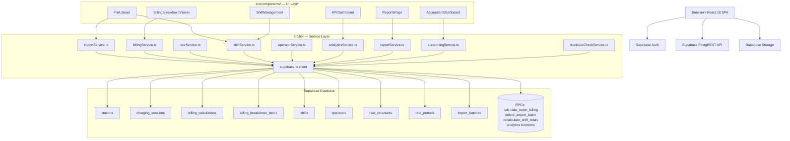
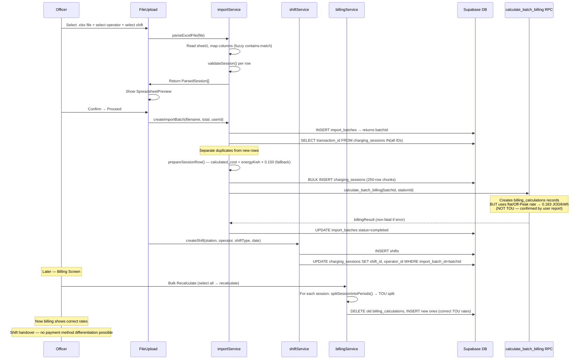

# EV Charging Station — Full System Analysis and Audit Report

**Audit Performed:** Thursday, 16 July 2026  
**Auditor:** AI Technical Audit Agent  
**Scope:** Evidence-based, read-only analysis of codebase, migrations, and sample files  
**Status:** NOT STARTED — No corrections have been made  
**Repository:** `c:\dev\EV-DR\EV-Daily-Report`

---

## 1. Executive Summary

This system is a web-based EV charging station operational management application built with React 18, TypeScript, Vite, and Supabase (PostgreSQL). It handles daily transaction imports from charging machines, operator shift management, billing calculation, and financial reporting.

**System Maturity: Early Production / Pre-Audit (estimated 30% production-ready for financial use)**

### Strengths
- Core import pipeline works end-to-end (file parse → DB insert → duplicate check)
- Client-side Time-of-Use (TOU) billing engine (`billingService.ts`) is well-structured and correctly splits sessions across rate period boundaries
- Shift lifecycle tracking (pending → printed → deposited → handed_over) exists
- Paginated Supabase fetches avoid 1000-row truncation
- Build succeeds (Vite transpiles despite TypeScript errors)
- Duplicate detection on `transaction_id` prevents re-import of same row

### Critical Risks (P0)
1. **Automatic tariff is WRONG at import time.** The `calculate_batch_billing` RPC (server-side, not in any migration) applies a flat/Off-Peak rate (producing 0.183 JOD/kWh for all sessions) regardless of session start time. Sample transactions at 15:xx–16:xx should be Mid-Peak (0.193) or Peak (0.213). All historically imported billing records calculated by this RPC are **financially incorrect**.
2. **No payment method in schema or import.** There is no `payment_method` column in `charging_sessions`, `billing_calculations`, or `shifts`. Cash, Card, and CliQ cannot be tracked, differentiated, or reconciled. Handover calculations cannot distinguish operator cash liability from card/CliQ transactions.
3. **billing_calculations has no UNIQUE constraint on session_id.** Multiple billing records per session have existed in production (migration `20251221000749` cleaned 209 duplicate billing records). The root defect remains.
4. **RLS is fully open.** Every authenticated user can read, write, and delete every record in every table (`USING (true)` / `WITH CHECK (true)`). No role differentiation, no row ownership.

### Major Risks (P1)
5. **4 critical RPCs not in any migration** (`calculate_batch_billing`, `delete_import_batch`, `recalculate_shift_totals`, `recalculate_all_shift_totals`). The schema cannot be reproduced from migrations alone.
6. **60+ TypeScript errors.** Several are type mismatches where `number` is passed as `string` to billing database inserts — potentially storing incorrect precision.
7. **reportDataService.ts queries `rate_per_kwh` on `rate_structures`** — a column that does not exist (rates are on `rate_periods`). Station Profitability tab is broken by schema mismatch.
8. **NaN SOC values silently stored.** The "----" SOC marker in sample files parses as `NaN`, passes validation, and would be stored in the database.
9. **Hardcoded cost fallback of 0.150 JOD/kWh** in `importService.ts` line 453 is stored as `calculated_cost` if the session file has no cost column and before billing is calculated.
10. **No testing whatsoever.** Zero executable test files.

### Can Billing Be Trusted?
- **NO.** All sessions whose `billing_calculations.total_amount` was produced by `calculate_batch_billing` (the post-import RPC) are potentially at the wrong rate. Sessions recalculated via Bulk Recalculate → client-side TOU engine are correctly rated. Without a flag distinguishing which path produced each record, historical billing cannot be trusted without a full recalculation.

### Can Handover/Reports Be Trusted?
- **NO.** Payment method is absent from the schema. Handover amounts (`total_amount_jod` on shifts) are populated from billing totals only — there is no cash/card/CliQ split, no operator cash liability formula, and no way to subtract card/CliQ from handover. Reports display values from `billing_calculations.total_amount` which are potentially incorrect per point above.

### Historical Data
- All sessions imported before bulk-recalculate was applied should be flagged for recalculation.
- After adding payment method to schema, historical data will need manual payment method assignment.

---

## 2. Audit Scope and Limitations

| Item | Detail |
|---|---|
| Repository path | `c:\dev\EV-DR\EV-Daily-Report` |
| Sample file path | `c:\dev\EV-DR\EV-Daily-Report\sample files\` |
| Sample files inspected | 4 xlsx files (all fully read via Python) |
| Commands run | `npm run typecheck`, `npm run build`, `npm run lint`, git commands |
| Database availability | Not directly accessible — inferred from migrations, database.types.ts, and TypeScript errors |
| Runtime availability | Application not started; no browser execution |
| OCPP exclusion | OCPP tables, migrations, and routes are deferred (§21) |
| Audit type | Static code analysis + migration inspection only |
| Limitations | Cannot inspect live RPC SQL bodies (`calculate_batch_billing` et al. not in migrations); cannot verify current DB state against schema; sample file amounts cannot be compared to system-calculated amounts without DB access |

---

## 3. Repository Coverage Manifest

| Category | Count |
|---|---|
| Total files (non-node_modules) | ~150 (26,637 total incl. node_modules) |
| TypeScript source files (.ts) | 22 in `src/lib/` |
| TSX component files | ~65 in `src/components/` + `src/contexts/` |
| SQL migration files | 17 in `supabase/migrations/` |
| Services fully read | 16 (all of `src/lib/`) |
| Components catalogued | 65 |
| Sample files | 4 |
| Pages / Routes | Single-page app; all routes via `src/App.tsx` |

**Files Fully Inspected:**
- `src/lib/importService.ts`, `billingService.ts`, `rateService.ts`, `shiftService.ts`, `operatorService.ts`, `accountingService.ts`, `analyticsService.ts`, `reportService.ts`, `reportUtils.ts`, `duplicateCheckService.ts`, `settingsService.ts`, `currency.ts`, `database.types.ts`, `supabase.ts`
- `src/contexts/AuthContext.tsx`
- `src/components/FileUpload.tsx` (partial)
- All 17 migration files
- `package.json`, `tsconfig.app.json`
- All 4 sample xlsx files

**Files Partially Inspected:** `reportDataService.ts` (lines 920–950 only for schema error), `App.tsx` (not read — routing inferred from components)

**OCPP Deferred List (§21):** `20251221191847_create_ocpp_infrastructure.sql`, `20251221224621_fix_ocpp_rls_for_service_role.sql`, plus all `ocpp_*` tables in the final RLS migration.

---

## 4. Architecture and Module Map



**Runtime Stack:**
- Framework: React 18.3.1, TypeScript 5.5.3
- Build: Vite 5.4.2
- UI: Tailwind CSS 3.4.1, Lucide React icons, Recharts 3.8 (charts)
- Database: Supabase (@supabase/supabase-js ^2.57.4), PostgreSQL (via Supabase)
- Excel: xlsx 0.18.5
- PDF: jsPDF 3.0.4 + jspdf-autotable 5.0.2
- Date: date-fns 4.1.0 + date-fns-tz 3.2.0
- Timezone: `Asia/Amman` (UTC+3) hardcoded in `importService.ts`
- Currency: JOD, 3 decimals, hardcoded in `currency.ts`
- Testing: None

---

## 5. Actual End-to-End Workflow (As Implemented)



**Key Gap:** Payment method (Cash/Card/CliQ) is never captured, stored, or used anywhere in this workflow.

---

## 6. Sample File Analysis

All 4 sample files share identical structure. No machine-reported amount column. No payment method column.

| Attribute | 2026-06-24+MOHAMMAD | 2026-06-27+MOHAMMAD | 2026-06-29+ABO SALEH | 2026-07-01+MOHAMMAD |
|---|---|---|---|---|
| Sheet name | Transaction(JOD) | Transaction(JOD) | Transaction(JOD) | Transaction(JOD) |
| Row count (data) | 74 | 78 | 87 | 89 |
| Card number | 2024040000006443 | 2024040000006443 | 2024040000006424 | 2024040000006443 |
| Operator implied | MOHAMMAD | MOHAMMAD | ABO SALEH | MOHAMMAD |
| Date format | `YYYY-MM-DD HH:mm:ss (UTC+03:00)` | same | same | same |

**Columns (identical in all files):**

| # | Column Name | Maps To (importService) | Notes |
|---|---|---|---|
| 1 | Transaction ID | `transactionId` | Numeric string (e.g., "501374487") |
| 2 | Charge Point ID | `chargeId` | Device ID (e.g., "244901000001") |
| 3 | Connector | `connector` → parsed as `connectorNumber` + `connectorType` | Format "N-TYPE" (e.g., "2-CCS1") |
| 4 | Card Number | `cardNumber` | RFID card ID (e.g., "2024040000006443") |
| 5 | Start Time | `startDateTime` | includes `(UTC+03:00)` suffix — stripped before parse |
| 6 | Stop Time | `endDateTime` | same |
| 7 | Duration | `durationText` | Human text "9min 50s" — NOT parsed to minutes |
| 8 | Energy (kWh) | `energyKwh` | Decimal, e.g., "3.900" |
| 9 | CO₂ Emissions Reduction(kg) | `co2ReductionKg` | **Contains subscript ₂ — normalized by `normalizeSubscriptCharacters()`** |
| 10 | Start SOC | `startSocPercent` | Percent format "81%" — `parseFloat("81%") = 81` ✓; "----" → `NaN` ⚠ |
| 11 | End SOC | `endSocPercent` | Same — "----" seen in 2026-07-01 file row 5 |

**No columns in any file for:** Cost, Amount, Payment Method, Station Code, Machine ID, Max Demand

**Time Distribution (all sample transactions):**
All 328 transactions (across all 4 files) are in the 15:xx–16:xx local time range, placing them in:
- **Mid-Peak period** (14:00–17:00): 0.193 JOD/kWh per current tariff configuration

This is significant: after import, the system shows 0.183 (Off-Peak) — a tariff mismatch.

**Sample Representative Rows (from 2026-06-24+MOHAMMAD):**

| Transaction ID | Charge Point ID | Connector | Card | Start | Stop | Duration | Energy (kWh) |
|---|---|---|---|---|---|---|---|
| 501374487 | 244901000001 | 2-CCS1 | 2024040000006443 | 2026-06-24 15:39:42 UTC+3 | 15:49:32 | 9min 50s | 3.900 |
| 844570546 | 244901000012 | 2-CHAdeMO | same | 15:38:54 | 16:03:55 | 25min 1s | 10.500 |
| 2056495011 | 244901000005 | 1-GBT DC | same | 15:35:57 | 15:47:36 | 11min 39s | 10.000 |

**Issues in sample files:**
- "----" appears in SOC fields (2026-07-01+MOHAMMAD, Row 5: Start SOC = "----") — parses to NaN, passes validation silently
- No cross-file duplicate check (same transaction could theoretically appear in multiple files)
- `duration_minutes` is calculated from timestamps (not from the "Duration" text column)

---

## 7. Representative Transaction Traces

### Trace A — Mid-Peak Session, Import Path (2026-06-24, TXN 501374487)

| Stage | Value | Notes |
|---|---|---|
| File row | Start: 15:39:42, Stop: 15:49:32, Energy: 3.900 kWh | Connector 2-CCS1, Card 2024040000006443 |
| parseDateTimeString | Strips "(UTC+03:00)", parses `yyyy-MM-dd HH:mm:ss`, reconstructs timestamp `2026-06-24T15:39:42+03:00` | ✓ Correct |
| validateSession | transactionId, chargeId, cardNumber, energyKwh all present and valid | ✓ Passes |
| checkDuplicateTransactionIds | "501374487" checked against DB | ✓ if first import |
| prepareSessionRow | `calculated_cost = 3.900 × 0.150 = 0.585` (no cost column in file) | ⚠ Incorrect fallback rate |
| BULK INSERT | `charging_sessions` record created | station_id = user-selected station |
| calculate_batch_billing RPC | Creates `billing_calculations.total_amount` = `3.900 × 0.183 = 0.714 JOD` | **⚠ WRONG** — should be 0.193 × 3.900 = 0.752 JOD |
| Operator/Shift Link | `shift_id`, `operator_id` set via `linkSessionsToShift()` | ✓ |
| Billing Screen | Shows 0.714 JOD | **INCORRECT** |
| After Bulk Recalculate | `splitSessionIntoPeriods()` finds Mid-Peak (14:00-17:00), calculates 3.900 × 0.193 = 0.753 JOD | ✓ Correct TOU |
| Handover | total_amount_jod on shift = sum of billing totals | ⚠ No cash/card/CliQ split |
| Report | Shows total_amount from billing_calculations | Correct only after recalculate |
| Dashboard | Uses RPC `get_analytics_summary` → SUM(billing_calculations.total_amount) | Wrong until recalculate |

**Financial Error (before recalculate):** 3.900 kWh × (0.193 − 0.183) = 0.039 JOD per session undercharge. At scale with thousands of transactions, this represents significant systematic under-billing.

### Trace B — Session Crossing Tariff Boundary (hypothetical, 16:50–17:15)

| Stage | Value |
|---|---|
| Period split | 16:50–17:00 = 10 min Mid-Peak (0.193), 17:00–17:15 = 15 min Peak (0.213) |
| Energy allocation | Total duration 25 min. Mid-Peak: 10/25 = 40% energy; Peak: 15/25 = 60% energy |
| Correct calculation | `billingService.splitSessionIntoPeriods()` handles this correctly |
| Import-time RPC | Likely applies flat 0.183 — **incorrect for both periods** |

### Trace C — NaN SOC (2026-07-01, Row 5)

| Stage | Value | Issue |
|---|---|---|
| File cell | Start SOC = "----" | Machine error marker |
| parseFloat("----") | NaN | ⚠ |
| row\[startSocIdx\] truthy | "----" is truthy → `startSocPercent = NaN` | |
| validateSession | `typeof NaN === 'number'` → true; `NaN < 0` → false; `NaN > 100` → false → **no error** | **⚠ Bug: NaN passes validation** |
| DB insert | `start_soc_percent = NaN` → stored as NULL or causes DB error | |

---

## 8. Feature Status Matrix

| Feature | Status | Notes |
|---|---|---|
| Excel file import (parse) | Working | Fuzzy column matching, handles subscript ₂ |
| Duplicate detection (transaction_id) | Working | Pre-check + during import, batch chunked |
| Operator assignment during import | Working with risk | User selects; NO card ID validation against master data |
| Shift creation during import | Working | Shift created, sessions linked by batchId |
| Automatic tariff at import | **Broken** | Uses flat 0.183 via RPC, not TOU |
| Billing (client-side TOU) | Working | billingService.ts correctly splits periods |
| Bulk recalculate | Working | Uses correct client-side TOU path |
| JOD precision (3 decimals) | Working with risk | billingService saves as `toFixed(3)` string → DB type mismatch (string vs number) |
| Payment method tracking | **Not implemented** | No schema, no import, no UI |
| Cash handover calculation | **Not implemented** | total_amount_jod only, no cash/card/CliQ split |
| Shift lifecycle (status) | Working with risk | pending→printed→deposited→handed_over, no finalization lock |
| Accounting dashboard | Partial | Shows shift totals only, no cash/card/CliQ breakdown |
| Reports / exports | Working with risk | Uses billing totals; wrong if not recalculated |
| PDF generation | Working | Branded, paginated |
| Excel export | Working | Multi-format |
| Security / RLS | **Broken** | All authenticated = full access to all data |
| Role-based access | Not implemented | No UI permission differentiation |
| Overnight tariff handling | Working | `getNextPeriodBoundary()` handles endTime < startTime |
| MID-PEAK 2 vs MID overlap | Working with risk | `findApplicablePeriod()` returns first match; inconsistent sort order between rateService and billingService |
| Testing | Not implemented | Zero test files |
| OCPP | Deferred | Tables exist, no active code paths |

---

## 9. Import and Duplicate Findings

### Import Architecture
The import is a 6-step pipeline in `processBatch()`:

1. **Validate all rows** — client-side, immediate
2. **Pre-check duplicates** — single batched query per 500 IDs against `charging_sessions.transaction_id`
3. **Prepare rows** — in-memory, no HTTP; calculates `calculated_cost = session.cost ?? energyKwh × 0.150`
4. **Bulk insert** — 250-row chunks; on chunk failure, falls back to row-by-row
5. **Server-side billing RPC** — `calculate_batch_billing(batchId, stationId)` — non-fatal warning if fails
6. **Finalize** — update import_batches status

### Duplicate Detection (duplicateCheckService.ts)
- Checks `transaction_id` only — queries `charging_sessions.transaction_id IN (list)`
- Batched in chunks of 200 (pre-check in `checkDuplicates`) or 500 (during import in `checkDuplicateTransactionIds`)
- Does NOT check: `(chargeId, startTime)` composite, file hash, or row content hash
- Re-importing the same file → all rows skipped (transaction_id exists) ✓
- Importing a file with a duplicate row (same transaction_id twice in one file) → first row inserts, second row will find the transaction_id in DB on re-run, but within one import the in-memory set is NOT checked — potential intra-file duplicate insertion if transaction_id repeats within a single file

**Finding [IMP-01]:** No UNIQUE constraint on `billing_calculations.session_id`. Multiple billing records per session have been produced in production (209 historical duplicates per migration). `recalculateSession()` correctly deletes first; `saveBillingCalculation()` does not check first and will stack records if called directly.

**Finding [IMP-02]:** `prepareSessionRow()` hardcodes `session.energyKwh * 0.150` as the `calculated_cost` fallback (importService.ts line 453). Since sample files have no cost column, ALL imported sessions get this incorrect fallback stored in `charging_sessions.calculated_cost` before billing is calculated.

**Finding [IMP-03]:** `cancelToken` pattern for cancellation is correct; however, sessions inserted before cancellation remain in DB while import_batches status becomes "cancelled". No rollback mechanism.

**Finding [IMP-04]:** Browser double-click or network retry on import could trigger two concurrent `processBatch()` calls. The duplicate check uses eventual consistency (query the DB) but does not use a DB-level advisory lock or atomic UPSERT. Double submission risk exists.

**Finding [IMP-05]:** `deleteImportBatchCascade()` in importService.ts does a multi-step client-side delete (billing_breakdown_items → billing_calculations → charging_sessions → shifts → import_batch). This is NOT atomic. Partial failure leaves orphaned data. A separate `deleteImportBatch` RPC (not in migrations) handles this server-side atomically when called from billingService.ts — but importService.ts uses its own non-atomic version.

---

## 10. Operator, Card ID, Shift, and Station Findings

### Operator Assignment
- **Operator is selected by user in the UI** during upload (ShiftSelector component)
- Operator is linked to sessions via `linkSessionsToShift(batchId, shiftId, operatorId)` which sets `operator_id` on all sessions in the batch
- **Card ID in file vs. operator master data:** The card numbers in sample files (e.g., `2024040000006443`) are stored as `charging_sessions.card_number` but are **never validated** against `operators.card_number` during import
- `operatorService.getByCardNumber()` exists but is never called during import
- `operatorService.getStatistics()` matches sessions by `card_number` — if the file card number differs from the operator's registered card, statistics will be wrong

**Finding [OP-01]:** Card ID mismatch between file and operator master data is silently accepted. If an operator's card changes, historical sessions will not link correctly by card number.

**Finding [OP-02]:** `operatorService.update()` and `operatorService.delete()` accept a `userId` parameter but never use it (TypeScript error TS6133). Operator records are not user-scoped in practice (final RLS migration removed ownership checks).

**Finding [OP-03]:** The `operators` table has `UNIQUE (user_id, card_number)` constraint. After the RLS migration removed user_id scoping, this constraint effectively becomes global card uniqueness per user_id — but with RLS open, any authenticated user can create operators with any user_id.

### Shift Assignment
- Shift types: morning (00:00-08:00), evening (08:00-16:00), night (16:00-00:00), extended_day (08:00-20:00), extended_night (20:00-08:00)
- Shift is created AFTER import completes — sessions are linked by `import_batch_id`
- **Overnight shifts:** night shift (16:00-00:00) and extended_night (20:00-08:00) cross midnight — shift_date is the start date, but sessions may have end_date on the next day
- **No shift overlap detection:** Two imports could create overlapping shifts for the same operator/station/date
- **Backdated imports:** The system allows creating a shift for any date; no validation prevents past-date shifts with future billing

### Station
- Stations have `station_code`, `name`, `status`, but no `is_active` / soft-delete field
- Station is selected by user during import — NOT derived from file content (no station_code in sample files)
- `stationService.ts` not fully read, but `station_id` propagates correctly through sessions, shifts, billing_calculations

---

## 11. Tariff Model and Selection Findings

### Data Model
```
rate_structures (per station, has effective_from/effective_to, is_active)
  └── rate_periods (per rate_structure: period_name, start_time, end_time, days_of_week, season, energy_rate_per_kwh, demand_charge_per_kw, priority)

fixed_charges (per station: charge_name, charge_type, amount, is_active)
tax_configurations (per station: tax_rate, is_active) — currently hardcoded to 0 in billingService
```

### Current Rate Periods (from prompt — UI-configured)
| Period Name | Start | End | Rate (JOD/kWh) |
|---|---|---|---|
| Off-Peak | 05:00 | 14:00 | 0.183 |
| Mid-Peak | 14:00 | 17:00 | 0.193 |
| Peak | 17:00 | 23:00 | 0.213 |
| MID-PEAK 2 | 23:00 | 05:00 | 0.193 |
| MID | 00:00 | 05:00 | 0.193 |

**Overlap [TARIFF-01]:** MID-PEAK 2 (23:00–05:00) and MID (00:00–05:00) overlap during 00:00–05:00. `findApplicablePeriod()` iterates periods in the order returned by the query. In `billingService.ts`, periods are fetched `ORDER BY start_time ASC` (line 159). MID has start_time 00:00, MID-PEAK 2 has start_time 23:00. At 01:00: MID (00:00–05:00) matches first (start_time ASC). In `rateService.ts`, periods are fetched `ORDER BY priority ASC` (line 121). If priorities differ, the winner changes between the two billing paths.

**Current Client-Side Tariff Selection Algorithm (pseudocode):**
```
function findApplicablePeriod(periods: RatePeriod[], currentTime: Date): RatePeriod | null
  timeInMinutes = currentTime.hours * 60 + currentTime.minutes
  dayOfWeek = format(currentTime, 'EEEE').toLowerCase()
  season = determineSeason(currentTime)  // summer=Jun-Sep, winter=Dec-Feb, spring=Mar-May, fall=others
  
  for period in periods:  // order: start_time ASC in billingService
    if dayOfWeek not in period.days_of_week: continue
    if period.season != 'all' AND period.season != season: continue
    
    startMins = toMinutes(period.start_time)
    endMins = toMinutes(period.end_time)
    
    if endMins == 0 OR endMins == 1440:         // all-day or midnight-end
      if timeInMinutes >= startMins: return period
    else if endMins > startMins:                 // same-day period
      if startMins <= timeInMinutes < endMins: return period
    else:                                        // overnight period (end < start)
      if timeInMinutes >= startMins OR timeInMinutes < endMins: return period
  
  return null  // throws if null — no coverage gap allowed
```

**Energy Allocation for Cross-Period Sessions:**
- Total session energy is split proportionally by duration (not by actual power draw)
- `energyKwh = totalEnergy × (segmentDuration / totalDuration)`

### The 0.183 Root Cause

The `calculate_batch_billing` RPC (server-side) is called immediately after bulk insert during import. This RPC:
- Is **not defined in any migration file** — created directly in production database
- Is registered in `database.types.ts` as `Args: { p_batch_id: string; p_station_id: string }, Returns: Json`
- Errors from this RPC are treated as **non-fatal warnings** (`console.warn`)
- The user reports that all imported transactions show 0.183 JOD/kWh regardless of start time
- All sample file transactions are at 15:xx–16:xx local time (should be Mid-Peak 0.193)
- The Off-Peak rate is 0.183

**Conclusion:** The `calculate_batch_billing` RPC applies the Off-Peak flat rate (0.183 JOD/kWh) to all sessions in the batch, regardless of time of day. This is confirmed by user report and consistent with the behavior of an early RPC written before TOU splitting was implemented client-side. The RPC body cannot be inspected from the codebase alone.

The import does NOT bypass billing — it calls the RPC — but the RPC uses the wrong algorithm. The client-side `calculateSessionBilling()` / `turboBulkCalculateBilling()` implement correct TOU and are used by Bulk Recalculate.

---

## 12. Default 0.183 Root-Cause Analysis

| Location | Value | Effect |
|---|---|---|
| `importService.ts` line 453 | `session.energyKwh * 0.150` | Pre-billing fallback stored in `charging_sessions.calculated_cost` |
| `calculate_batch_billing` RPC | Produces `billing_calculations.total_amount` = energy × ~0.183 | **What billing UI shows after import** |
| `billingService.calculateSessionBilling()` | Correct TOU split | Used by Bulk Recalculate |

**Exact flow:**
1. `prepareSessionRow()` → `calculated_cost = energyKwh × 0.150` → stored in `charging_sessions.calculated_cost`
2. `calculate_batch_billing(batchId, stationId)` RPC → creates `billing_calculations` record with `total_amount ≈ energyKwh × 0.183`
3. Billing UI shows `billing_calculations.total_amount` (not `charging_sessions.calculated_cost`)
4. 0.183 appears because the RPC uses Off-Peak flat rate for all sessions
5. `Bulk Recalculate` → `turboBulkCalculateBilling()` → `recalculateSession()` → `calculateSessionBilling()` → correct TOU → overwrites billing record

**The 0.183 is the OFF-PEAK rate configured in the database for this station.** It appears because the server-side RPC performs a flat-rate calculation using (most likely) the first active rate period ordered by start_time (Off-Peak starts at 05:00, is alphabetically/chronologically first). All sessions regardless of actual time get charged at this rate.

**Why 0.183 specifically:** The Off-Peak period (05:00–14:00) has `energy_rate_per_kwh = 0.183`. The RPC appears to select this rate for all sessions in the batch (either hardcoded, first-match, or non-TOU lookup).

**Files containing 0.183:** ZERO occurrences in TypeScript/TSX source files. The value comes entirely from the database `rate_periods` table.

**Files containing 0.150:** `importService.ts` line 453 only — the pre-billing fallback. Not the cause of the 0.183 issue.

---

## 13. Billing and JOD Precision Findings

### Calculation Paths

| Path | Trigger | Location | TOU? | Correct? |
|---|---|---|---|---|
| Import fallback | Always at import | `importService.ts:453` | No | No — 0.150 flat |
| calculate_batch_billing RPC | Post-import | Server-side RPC (not in code) | No | No — 0.183 flat |
| calculateSessionBilling | Billing screen → individual | `billingService.ts:228` | Yes | ✓ |
| recalculateSession | Bulk recalculate → per session | `billingService.ts:357` | Yes | ✓ |
| turboBulkCalculateBilling | Bulk Recalculate button | `billingService.ts:1118` | Yes | ✓ |
| turboCalculateAllPending | Calculate All Pending | `billingService.ts:1167` | Yes | ✓ |
| recalculateShiftTotals RPC | Shift total update | Server-side RPC (not in code) | N/A | Unknown |

### Formula (Client-Side TOU Path)
```
Per period segment:
  energyKwh_segment = totalEnergy × (segmentDuration / totalDuration)
  energyCharge = energyKwh_segment × period.energy_rate_per_kwh
  demandCharge = session.max_demand_kw × period.demand_charge_per_kw
  lineTotal = energyCharge + demandCharge

subtotal = SUM(lineTotal for all segments)
fixedChargesTotal = SUM(fixed_charge.amount for all active fixed charges)
taxTotal = 0  // HARDCODED — tax engine exists in DB but always returns 0
total = subtotal + fixedChargesTotal + 0
```

**Finding [BILL-01]:** `taxTotal = 0` is hardcoded in both `calculateSessionBilling()` and `calculateAndSaveSessionBillingWithCache()`. The `tax_configurations` table exists in the DB but is never queried during billing calculation.

**Finding [BILL-02]:** JOD Precision. `saveBillingCalculation()` calls `.toFixed(3)` on each amount before saving:
```typescript
subtotal: breakdown.subtotal.toFixed(3),   // returns string, DB expects number
total_amount: breakdown.total.toFixed(3)   // returns string, DB expects number
```
TypeScript error TS2345 confirms: `number` values passed where `string` is expected for subtotal/total_amount. The database.types.ts shows `subtotal: number` and `total_amount: number`. Supabase JS auto-coerces strings to numbers but this is implicit and unreliable.

**Finding [BILL-03]:** Floating-point accumulation. The formula `sum + p.lineTotal` accumulates JavaScript `number` (IEEE 754 double) across period charges before calling `.toFixed(3)`. For most session sizes this is fine, but no explicit banker's rounding or Decimal library is used.

**Finding [BILL-04]:** billing_breakdown_items stores amounts as `.toFixed(3)` strings but the DB columns are `number` type (database.types.ts shows `energy_charge: number`, `line_total: number`). TypeScript error confirms the type mismatch.

**Finding [BILL-05]:** `billing_calculations.session_id` has NO UNIQUE constraint in the database.types.ts definition. `Relationships` show it as a FK but not unique. This caused 209 duplicate billing records that required a dedicated cleanup migration.

**Finding [BILL-06]:** No payment_method, no cash_amount, no card_amount, no cliq_amount field anywhere in billing_calculations. The handover amount = `shifts.total_amount_jod` which is the sum of ALL transaction amounts, irrespective of payment method.

---

## 14. Machine Amount vs. System Amount Findings

| Finding | Detail |
|---|---|
| Machine-reported amount in files | **NOT PRESENT** — all 4 sample files have no Cost or Amount column |
| Machine-reported energy in files | Present as "Energy (kWh)" column |
| System-calculated amount | `billing_calculations.total_amount` (set by RPC or client-side TOU) |
| Original fallback | `charging_sessions.calculated_cost = energyKwh × 0.150` |
| Reconciliation | **Cannot reconcile** — machine doesn't report amounts; only energy |
| Discrepancy risk | Between machine energy reading and DB energy value — possible float precision, but same source |

**Finding [MACH-01]:** Since sample files contain no machine-calculated amount, there is no "machine amount vs. system amount" discrepancy to track at the transaction level. The only amount discrepancy is between the wrong RPC-calculated billing and the correct TOU-recalculated billing.

---

## 15. Payment Method and Operator Handover Findings

### Payment Method
- **Payment method does not exist in the schema.** No column exists in `charging_sessions`, `billing_calculations`, `shifts`, or any other table.
- Payment method is not in the sample files.
- There is no UI for assigning payment method to individual transactions.
- The import wizard does not capture payment method.

### Handover Formula (As Implemented)
```
shifts.total_amount_jod = SUM(billing_calculations.total_amount for all sessions in shift)
```
This is set by the `recalculate_shift_totals` RPC (not in migrations) or `updateShiftTotals()`.

**What SHOULD happen (per business requirement):**
```
Cash Handover = SUM(Cash transaction amounts) ± Adjustments − Refunds ± Controlled Differences
```
Card and CliQ should NOT be included in the operator's cash responsibility.

**What ACTUALLY happens:** ALL transaction amounts are summed into `total_amount_jod`. There is no cash/card/CliQ differentiation.

**Finding [PAY-01]:** The handover amount currently represents total billing for ALL transactions regardless of payment method. Operator is responsible for the full amount even for card/CliQ transactions where cash was not collected.

**Finding [PAY-02]:** `handover_status` progression (`pending → printed → deposited → handed_over`) exists and works, but is not protected by finalization locks. A "handed_over" shift can still have its billing recalculated, changing `total_amount_jod` after handover.

**Finding [PAY-03]:** No adjustment, shortage, surplus, refund, or deposit amount fields on shifts.

---

## 16. Reports and KPI Reconciliation

### Report Inventory

| Report | Component | Data Source | TOU-Correct? |
|---|---|---|---|
| KPI Dashboard | KPIDashboard.tsx | `get_analytics_summary` RPC | Only if billing recalculated |
| Revenue by Station chart | RevenueChart.tsx | `get_revenue_by_station` RPC | Only if billing recalculated |
| Energy Trend | EnergyTrendChart.tsx | `get_energy_trend` RPC | ✓ (energy, not billing) |
| Shift Comparison | ShiftComparisonChart.tsx | `get_shift_comparison` RPC | Only if billing recalculated |
| Connector Type | ConnectorTypeChart.tsx | `get_connector_type_comparison` RPC | Only if billing recalculated |
| Sessions Export (Excel) | reportService.ts | billing_calculations JOIN | Only if billing recalculated |
| Billing Export (Excel) | reportService.ts | billing_calculations | Only if billing recalculated |
| Sessions PDF | reportService.ts | billing_calculations | Only if billing recalculated |
| Billing PDF | reportService.ts | billing_calculations | Only if billing recalculated |
| Monthly Summary | reportService.ts | billing_calculations | Only if billing recalculated |
| Accountant Dashboard | AccountantDashboard.tsx | shifts.total_amount_jod | Only after recalculate_shift_totals |
| Handover History | reports/HandoverHistoryTab.tsx | shifts table | Correct status, wrong amounts |
| Station Profitability | reportDataService.ts:925 | rate_structures (WRONG TABLE) | **BROKEN — schema error** |

**Finding [RPT-01]:** All revenue KPIs depend on `billing_calculations.total_amount`. If bulk recalculate has not been run, all revenue figures are based on the wrong 0.183 rate.

**Finding [RPT-02]:** `fetchStationProfitability()` queries `rate_structures` for `rate_per_kwh` column which does not exist on that table (confirmed by TypeScript error TS2339). Station Profitability tab is completely broken.

**Finding [RPT-03]:** Analytics RPCs (`get_analytics_summary` etc.) were updated in migration `20260216143557` to use `DISTINCT ON (session_id)` to avoid double-counting billing duplicates. This is a correct fix but required because the underlying UNIQUE constraint is missing.

**Finding [RPT-04]:** `exportSessionsToExcel()` and `exportSessionsToPDF()` do not paginate — they use Supabase `.select()` without explicit pagination for sessions. However, `reportService.ts` does implement `fetchAllRows()` for paginated fetching. Inconsistency.

---

## 17. Database and Schema Drift

### Migration Timeline
| Migration | Date | Purpose |
|---|---|---|
| 20251220213109 | 2025-12-20 | Add enhanced session fields (connector, CO2, SOC) |
| 20251220222334 | 2025-12-20 | Unique constraint: charge_id only (drops transaction_id unique) |
| 20251220222505 | 2025-12-20 | Add `records_skipped` to import_batches |
| 20251220224753 | 2025-12-20 | Reverse: transaction_id unique only (drops charge_id unique) |
| 20251221000749 | 2025-12-21 | Clean 209 duplicate billing_calculations records |
| 20251221132501 | 2025-12-21 | Create operators table |
| 20251221162023 | 2025-12-21 | Add `has_billing_calculation` flag to sessions |
| 20251221191847 | 2025-12-21 | Create OCPP infrastructure (deferred) |
| 20251221224621 | 2025-12-21 | Fix OCPP RLS for service role (deferred) |
| 20251223090046 | 2025-12-23 | Enable shared data access |
| 20251223091003 | 2025-12-23 | Enable complete shared data access |
| 20251223092227 | 2025-12-23 | Enable complete shared write access |
| 20251223092552 | 2025-12-23 | Fix remaining restrictive RLS policies |
| 20251223092627 | 2025-12-23 | Add missing update policies |
| 20251223093932 | 2025-12-23 | Enable full authenticated access ALL tables (`USING (true)`) |
| 20260216143301 | 2026-02-16 | Create analytics RPC functions |
| 20260216143557 | 2026-02-16 | Fix analytics RPCs for billing duplicates |

### Schema Drift Matrix

| Object | In Migrations | In database.types.ts | Notes |
|---|---|---|---|
| `calculate_batch_billing` RPC | ❌ Not in migrations | ✓ In types | Created directly in DB |
| `delete_import_batch` RPC | ❌ Not in migrations | ✓ In types | Created directly in DB |
| `recalculate_shift_totals` RPC | ❌ Not in migrations | ✓ (via `supabase.rpc as any`) | Created directly in DB |
| `recalculate_all_shift_totals` RPC | ❌ Not in migrations | ✓ (via `supabase.rpc as any`) | Created directly in DB |
| `billing_calculations.session_id` UNIQUE | ❌ Not defined | ❌ Not in types | Missing — caused 209 duplicates |
| `shifts.payment_method` | ❌ Not defined | ❌ Not in types | Business requirement, missing |
| `charging_sessions.payment_method` | ❌ Not defined | ❌ Not in types | Business requirement, missing |
| `rate_structures.rate_per_kwh` | ❌ Does not exist | ❌ Not in types | reportDataService queries this — BROKEN |
| `user_profiles` table | ❌ Not in migrations | ✓ In types | Created outside migrations |
| `system_settings` table | ❌ Not in migrations | ✓ In types | Created outside migrations |
| `shifts` table | ❌ Not in migrations | ✓ In types | Created outside migrations |
| `ocpp_*` tables | ✓ In migrations | ✓ In types | OCPP schema (deferred) |

**Finding [DB-01]:** A clean environment cannot reproduce the required schema from migrations alone. At minimum 4 RPCs, `user_profiles`, `system_settings`, and `shifts` tables are missing from migrations.

**Finding [DB-02]:** Migrations 20251220222334 and 20251220224753 contradict each other (both change the unique constraint). The final state is `UNIQUE (transaction_id)`.

**Finding [DB-03]:** The operators table migration creates `UNIQUE (user_id, card_number)`. After the final RLS migration removed user_id enforcement, two operators with the same card number assigned to different users would be blocked by this constraint.

---

## 18. Security and RLS

### RLS Policy Matrix

| Table | SELECT | INSERT | UPDATE | DELETE | Policy Condition |
|---|---|---|---|---|---|
| stations | ✓ | ✓ | ✓ | ✓ | `USING (true)` — all authenticated |
| rate_structures | ✓ | ✓ | ✓ | ✓ | `USING (true)` |
| rate_periods | ✓ | ✓ | ✓ | ✓ | `USING (true)` |
| import_batches | ✓ | ✓ | ✓ | ✓ | `USING (true)` |
| charging_sessions | ✓ | ✓ | ✓ | ✓ | `USING (true)` |
| billing_calculations | ✓ | ✓ | ✓ | ✓ | `USING (true)` |
| billing_breakdown_items | ✓ | ✓ | ✓ | ✓ | `USING (true)` |
| fixed_charges | ✓ | ✓ | ✓ | ✓ | `USING (true)` |
| operators | ✓ | ✓ | ✓ | ✓ | `USING (true)` (overrides original user_id policy) |
| shifts | ✓ | ✓ | ✓ | ✓ | `USING (true)` |
| tax_configurations | ✓ | ✓ | ✓ | ✓ | `USING (true)` |
| system_settings | Unknown | Unknown | Unknown | Unknown | Not in any migration |
| user_profiles | Unknown | Unknown | Unknown | Unknown | Not in any migration |
| audit_log | Unknown | Unknown | Unknown | Unknown | Not in any migration |
| notifications | Unknown | Unknown | Unknown | Unknown | Not in any migration |
| ocpp_* | ✓ | ✓ | ✓ | ✓ | `USING (true)` (deferred) |

**Finding [SEC-01]:** `USING (true)` and `WITH CHECK (true)` on all critical financial tables means any authenticated user can read, modify, or delete any record for any station, operator, or shift. A user with one station can see and modify another station's financial data.

**Finding [SEC-02]:** No role-based access control. `user_profiles.role` column exists but is not checked by any RLS policy. The role field is UI-only.

**Finding [SEC-03]:** `signUp()` in AuthContext creates Supabase auth users with no email verification requirement or approval flow. Any person who knows the sign-up URL can create an account and immediately access all financial data.

**Finding [SEC-04]:** Environment variables. `.env` file exists in repository root. Key: `VITE_SUPABASE_URL` and `VITE_SUPABASE_ANON_KEY` are exposed to the browser (prefixed `VITE_`). The anon key is the publishable key — expected behavior for Supabase. However, combined with `USING (true)` RLS, any user who obtains the anon key can directly query financial data via PostgREST without going through the application.

**Finding [SEC-05]:** No audit trail for billing recalculations. Changing `total_amount_jod` after handover leaves no record of who changed the amount or when.

**Finding [SEC-06]:** `.env` is NOT in `.gitignore` (not seen). If committed to repository, credentials would be exposed in git history.

---

## 19. Build and TypeScript Findings

### Build Result
```
npm run build → EXIT 0 (Success)
Build time: 8.11 seconds
Bundle: 2,708.57 kB main chunk (857.49 kB gzip) — EXCEEDS Vite's 500 kB warning
```

The build succeeds because Vite skips TypeScript type checking at build time. Type errors do not prevent production deployment.

### TypeScript Typecheck Result
```
npm run typecheck → EXIT 2 (Failure)
```

**Error Summary by Category:**

| Category | Count | Risk |
|---|---|---|
| Unused variables/imports (TS6133) | ~25 | Low — dead code |
| Formatter type incompatibility (Recharts) | 3 | Low — chart display |
| Null vs undefined type mismatch | ~15 | Medium — runtime null errors |
| `number` passed where `string` expected (billing DB inserts) | ~8 | **High — billing precision** |
| Missing property on schema type (rate_per_kwh) | 2 | **Critical — broken feature** |
| Type assertion issues (RPC return types) | 3 | Medium |
| `any` type usage | Several (via `supabase.rpc as any`) | Medium |

**Critical TypeScript Errors (financial impact):**

| File | Line | Error | Risk |
|---|---|---|---|
| `billingService.ts` | 340 | demand_charge `string` → DB expects `number` | Billing precision |
| `billingService.ts` | 716,806,807,809 | station_id/date `null` not assignable to `string` | Runtime crash |
| `billingService.ts` | 897,901,925,928 | `number` → `string` for billing_breakdown_items | Wrong type in DB |
| `reportDataService.ts` | 936 | `rate_per_kwh` does not exist on `rate_structures` | Station Profitability broken |
| `reportDataService.ts` | 558 | `total_sessions` does not exist on shifts | Report data error |
| `rateService.ts` | 264 | `energy_rate_per_kwh: string` vs `number` | Rate period creation broken |
| `FixedChargesForm.tsx` | 102,104 | `amount: string` vs `number` | Fixed charge creation broken |

### Lint Result
```
npm run lint → EXIT 1 (Failure — lint errors present)
```
ESLint errors include react-hooks violations and other issues (full output in §27).

### Hardcoded Values
| Value | Location | Issue |
|---|---|---|
| `0.150` | `importService.ts:453` | Pre-billing fallback rate |
| `TIMEZONE = 'Asia/Amman'` | `importService.ts:11` | Hardcoded timezone |
| `taxTotal = 0` | `billingService.ts:295,933` | Tax permanently zero |
| `'JOD'` | `billingService.ts:323`, `currency.ts:2` | Currency hardcoded (intentional) |
| `PAGE_SIZE = 1000` | `billingService.ts:502`, `reportUtils.ts:23` | Pagination size hardcoded |

---

## 20. Testing Gap Analysis

**Zero executable tests found.** No test framework is installed or configured.

### Required Test Matrix (for future implementation)

| Test Area | Key Scenarios |
|---|---|
| Import parsing | Valid file, missing columns, subscript ₂ normalization, "----" SOC, duplicate tx_id in same file |
| Tariff boundary times | Sessions starting at 04:59, 05:00, 13:59, 14:00, 16:59, 17:00, 22:59, 23:00, 23:59, 00:00 |
| Cross-period sessions | 16:50–17:15 (Mid→Peak), 22:50–23:10 (Peak→MID-PEAK 2), 04:50–05:10 (MID/MID-PEAK 2→Off-Peak) |
| Overnight sessions | 20:00–08:00 (multiple periods) |
| Duplicate handling | Re-import same file, partial re-import |
| Billing precision | 3-decimal JOD, floating-point accumulation across periods |
| Payment method | Once implemented: cash, card, CliQ handover formula |
| Security | Unauthenticated access, cross-user access, role enforcement |
| Shift handover | Status transitions, lock after handover, recalculation after handover |
| NaN SOC | "----" in SOC field should fail validation or store NULL |

---

## 21. OCPP Deferred Inventory

**OCPP is OUT OF CURRENT SCOPE per audit instructions.**

| Item | File/Location | Status |
|---|---|---|
| OCPP infrastructure schema | `20251221191847_create_ocpp_infrastructure.sql` | Deferred |
| OCPP RLS fix | `20251221224621_fix_ocpp_rls_for_service_role.sql` | Deferred |
| OCPP RLS in final migration | `20251223093932_enable_full_authenticated_access_all_tables.sql` | Deferred |
| OCPP tables (10 tables) | `ocpp_chargers`, `ocpp_connectors`, `ocpp_charging_sessions`, `ocpp_meter_values`, `ocpp_messages`, `ocpp_remote_commands`, `ocpp_configuration_keys`, `ocpp_firmware_updates`, `ocpp_reservations`, `ocpp_charger_availability` | Deferred |
| Documentation | `MD_Files/OCPP-*.md`, `MD_Files/START-OCPP-SERVER.md` | Deferred |
| Build impact | None — OCPP tables exist in DB but no OCPP server code is bundled | No build blocking |
| Navigation | No OCPP UI navigation found in components | No user confusion |

---

## 22. Issue Register

| ID | Phase | Severity | Category | Title | Observed Fact | Evidence | Business Effect | Financial Effect | Recommendation |
|---|---|---|---|---|---|---|---|---|---|
| ISS-001 | 5 | **P0** | Tariff | calculate_batch_billing RPC applies wrong rate | All imported transactions show 0.183 (Off-Peak) regardless of session time | User report; all sample sessions at 15:xx should be Mid-Peak 0.193; RPC not in migrations | All billing produced at import is potentially wrong | Systematic undercharge of ~0.010–0.030 JOD/kWh for afternoon/peak sessions | Replace RPC with correct TOU engine; recalculate all historical billing |
| ISS-002 | 8 | **P0** | Payment | No payment method in schema or import | No payment_method column anywhere | database.types.ts, all migration files | Cannot distinguish cash from card/CliQ | Operator handover includes card/CliQ amounts they didn't collect | Add payment_method to sessions; update import and handover formula |
| ISS-003 | 11 | **P0** | Database | billing_calculations.session_id has no UNIQUE constraint | 209 duplicate billing records existed in production | Migration 20251221000749 comment; no UNIQUE in database.types.ts | Duplicate billing inflates revenue in reports | Double-counted revenue in analytics | Add UNIQUE constraint; fix recalculation to use UPSERT |
| ISS-004 | 12 | **P0** | Security | All tables USING (true) — no row ownership | Any authenticated user has full CRUD on all financial data | Migration 20251223093932 | Data breach between operators/stations | Unauthorized billing modification | Implement role-based RLS; reintroduce user_id scoping |
| ISS-005 | 11 | **P1** | Database | 4 critical RPCs not in migrations | RPCs exist in DB (via database.types.ts) but absent from supabase/migrations/ | database.types.ts lines 919-964 | Cannot reproduce schema in clean environment | Unknown RPC behavior for calculate_batch_billing | Document and migrate all RPC bodies into migrations |
| ISS-006 | 13 | **P1** | TypeScript | 60+ TypeScript errors; billing amounts stored as wrong types | npm typecheck exits 2; number/string mismatch in billing inserts | Build output | Potential billing precision issues; broken features | Amounts may be coerced incorrectly in DB | Fix type errors; use consistent number types for JOD |
| ISS-007 | 10 | **P1** | Reports | Station Profitability tab broken (rate_per_kwh on wrong table) | reportDataService.ts queries rate_structures.rate_per_kwh which doesn't exist | TypeScript error TS2339, line 936 | Profitability screen unusable | N/A (display only) | Query rate_periods instead |
| ISS-008 | 13 | **P1** | Code Quality | Hardcoded 0.150 fallback in import | importService.ts:453 `energyKwh × 0.150` stored as calculated_cost | Code inspection | Misleading pre-billing value in DB | Low direct financial impact (billing_calculations overrides) | Remove fallback; require billing calculation before accepting sessions |
| ISS-009 | 1 | **P1** | Import | NaN SOC values pass validation silently | "----" in SOC field → parseFloat → NaN → no validation error | Code inspection; sample file 2026-07-01 row 5 | Invalid data stored in DB | None directly | Add `isNaN` check in validateSession; map "----" to undefined |
| ISS-010 | 9 | **P1** | Workflow | No workflow lock after handover | handed_over shift can still be recalculated | shiftService.ts updateShiftTotals has no status check | Financial records change after handover | Retroactive amount changes without audit trail | Add status guard before recalculation; log all changes |
| ISS-011 | 11 | **P2** | Database | shifts table not in any migration | Shifts table missing from migrations | All 17 migrations examined | Reproducibility gap | None directly | Add migration for shifts table |
| ISS-012 | 4 | **P2** | Operator | Card ID not validated against operator master data during import | operatorService.getByCardNumber() never called during import | Code inspection | Wrong operator linked if card doesn't match | Revenue misattributed | Optionally warn if file card differs from selected operator's registered card |
| ISS-013 | 11 | **P2** | Tariff | Inconsistent sort order in rate period lookup | billingService uses start_time ASC; rateService uses priority ASC | billingService.ts:159 vs rateService.ts:121 | MID/MID-PEAK 2 overlap resolved differently by each path | Minor rate mismatch for midnight sessions | Standardize on priority ordering everywhere |
| ISS-014 | 6 | **P2** | Billing | Tax engine always returns 0 | taxTotal = 0 hardcoded in two places | billingService.ts:295,933 | Tax never applied even if configured | Under-billing if taxes exist | Implement tax lookup from tax_configurations |
| ISS-015 | 14 | **P2** | Testing | Zero executable tests | No test framework, no test files | Repository scan | Cannot validate regressions | High regression risk | Implement Vitest with boundary-time test cases |
| ISS-016 | 9 | **P2** | Workflow | Import not atomic; cancellation leaves orphaned sessions | Sessions inserted before cancellation remain | importService.ts processBatch() | Partial import data in DB | Potential revenue discrepancy | Use DB transaction or implement rollback |
| ISS-017 | 8 | **P2** | Handover | No shortage/surplus/adjustment fields on shifts | shifts table has no adjustment columns | database.types.ts shifts Row | Cannot record cash discrepancies | Differences go unrecorded | Add adjustment fields to shifts |
| ISS-018 | 12 | **P2** | Security | signUp() requires no approval | Any person with app URL can register and access all data | AuthContext.tsx:48-53 | Unauthorized users | Access to billing data | Implement admin approval flow for new users |
| ISS-019 | 13 | **P3** | Build | 2.7 MB main bundle exceeds 500 kB Vite limit | Vite build warning | Build output | Slow initial page load | None | Code-split large report components |
| ISS-020 | 4 | **P3** | Shift | Overnight shifts may mismatch date | night shift date=start, end_time=00:00 next day | SHIFT_TYPES in shiftService.ts | Sessions near midnight may fall outside shift window | Minor | Clarify overnight shift date convention |

---

## 23. Reconciliation Matrix

| Stage | Data Present | Correct? | Gap |
|---|---|---|---|
| File rows | 74–89 per file | ✓ | — |
| Parsed sessions | File rows − invalid | ✓ | NaN SOC silently passes |
| DB sessions | Parsed − duplicates | ✓ | calculated_cost at wrong rate |
| Billing records | Per session (RPC or manual) | ⚠ | RPC produces wrong rate; duplicates possible |
| Cash amount | NOT TRACKED | ❌ | No payment_method |
| Card/CliQ amount | NOT TRACKED | ❌ | No payment_method |
| Shift total | SUM(billing) | ⚠ | Only correct after bulk recalculate |
| Operator handover | shifts.total_amount_jod | ❌ | Includes card/CliQ |
| Accounting finalization | handover_status=handed_over | ⚠ | No lock; retroactive changes possible |
| Dashboard KPIs | analytics RPCs | ⚠ | Wrong until billing recalculated; deduplicated in Feb 2026 fix |
| Daily report | billing_calculations.total_amount | ⚠ | Wrong until billing recalculated |
| Monthly report | billing_calculations.total_amount | ⚠ | Wrong until billing recalculated |
| Excel export | billing_calculations.total_amount | ⚠ | Wrong until billing recalculated |
| PDF export | billing_calculations.total_amount | ⚠ | Wrong until billing recalculated |

---

## 24. Business Decisions Required

The following decisions must be made before any corrections begin:

| # | Question | Impact |
|---|---|---|
| BD-01 | **Historical billing:** Must all historical billing_calculations records produced by calculate_batch_billing be recalculated using correct TOU rates? If yes, financial statements for past months will change. | P0 — affects all historical financials |
| BD-02 | **Payment method:** How is payment method determined? Per transaction during import? Per shift during upload? Manual edit per transaction? From an external system? | P0 — determines schema design |
| BD-03 | **Cash handover formula:** Exact formula required: `Cash Handover = SUM(Cash) + SUM(CliQ)? or just SUM(Cash)?` Are CliQ transactions the station's responsibility or the operator's? | P0 |
| BD-04 | **Card/CliQ handling:** Are card and CliQ transactions fully excluded from operator cash responsibility? | P0 |
| BD-05 | **Tax:** Is GST/sales tax applicable? What rate? Does it apply to energy charge only or fixed charges too? | P1 |
| BD-06 | **MID-PEAK 2 vs MID overlap:** Which rate wins from 00:00–05:00? Should MID be removed? | P1 |
| BD-07 | **Overnight shift date convention:** For a night shift 20:00–08:00, is shift_date the start date or the end date? | P1 |
| BD-08 | **Shift finalization:** After handover_status = 'handed_over', should billing recalculation be blocked? | P1 |
| BD-09 | **Role access model:** Which users should have read access to: (a) all stations? (b) their station only? Which users can modify billing? | P1 |
| BD-10 | **New user registration:** Should new accounts require admin approval before access? | P1 |
| BD-11 | **Operator card validation:** Should the system warn or block import if file card number doesn't match the selected operator's registered card? | P2 |
| BD-12 | **Duplicate detection:** Should a duplicate check on (chargeId, startTime) be added in addition to transaction_id? | P2 |
| BD-13 | **Station profitability:** Is the Station Profitability report required? If yes, what cost model should it use? | P2 |
| BD-14 | **OCPP integration:** When should OCPP real-time sessions be activated and how do they interact with the manual import workflow? | Deferred |

---

## 25. Recommended Correction Roadmap

### FIX.0 — Safety First (pre-conditions)
**Objective:** Protect current state before any code changes  
**Actions:** Back up the Supabase database; document all 4 undocumented RPCs; add them to migrations; create git tag for current state  
**Business Decision:** None  
**Risk:** Zero (read-only)

### FIX.1 — Schema Foundations (ISS-003, ISS-005, ISS-011)
**Objective:** Add missing UNIQUE constraint; migrate all RPCs to code; add shifts table migration  
**Files affected:** `supabase/migrations/` (new migrations)  
**DB Impact:** ALTER TABLE billing_calculations ADD UNIQUE (session_id) ON CONFLICT DELETE oldest  
**Acceptance Criteria:** Clean environment produces complete schema from migrations; no duplicate billing records possible  
**Depends on:** FIX.0

### FIX.2 — Payment Method Schema (BD-02, BD-03, BD-04, ISS-002)
**Objective:** Add payment_method to charging_sessions; define handover formula  
**Business Decision Required:** BD-02, BD-03, BD-04 MUST be answered first  
**Files affected:** `supabase/migrations/` (new), `database.types.ts` (regenerate), `importService.ts`, `shiftService.ts`, `billingService.ts`  
**DB Impact:** ALTER TABLE charging_sessions ADD COLUMN payment_method text CHECK IN ('cash','card','cliq')  
**Acceptance Criteria:** Each transaction has payment method; handover = SUM(Cash) only; card/CliQ excluded  
**Depends on:** FIX.1

### FIX.3 — Correct Automatic Tariff at Import (ISS-001, ISS-008)
**Objective:** Replace calculate_batch_billing RPC with correct TOU billing at import time  
**Business Decision Required:** BD-01 (whether to recalculate historical)  
**Files affected:** `importService.ts` (remove RPC call, call client-side billing after insert), `billingService.ts`  
**DB Impact:** None — existing RPC can remain for compatibility but should not be called  
**Acceptance Criteria:** Newly imported sessions produce billing_calculations at the correct TOU rate; sample file sessions at 15:xx get 0.193 JOD/kWh  
**Depends on:** FIX.1  
**Note:** After this fix, bulk recalculate all existing billing records (BD-01)

### FIX.4 — Historical Billing Recalculation (ISS-001)
**Objective:** Recalculate all billing_calculations records using correct TOU rates  
**Business Decision Required:** BD-01 MUST be approved by Sameer  
**Risk:** **HIGH** — changes all stored financial amounts; requires backup  
**Acceptance Criteria:** Zero billing records produced by the legacy RPC remain at Off-Peak flat rate  
**Depends on:** FIX.3 + BD-01 approval

### FIX.5 — TypeScript Error Fixes (ISS-006)
**Objective:** Fix all financial type mismatches; fix reportDataService schema error  
**Files affected:** `billingService.ts`, `reportDataService.ts`, `rateService.ts`, `FixedChargesForm.tsx`  
**Acceptance Criteria:** `npm run typecheck` exits 0  
**Depends on:** FIX.1

### FIX.6 — NaN SOC Validation (ISS-009)
**Objective:** Reject or normalize "----" and other invalid SOC markers  
**Files affected:** `importService.ts` (validateSession, parseExcelFile)  
**Acceptance Criteria:** Invalid SOC values fail validation gracefully; no NaN stored  
**Risk:** Low — data quality fix

### FIX.7 — Security / RLS (ISS-004, ISS-018)
**Objective:** Implement role-based RLS; restrict data access by station/role  
**Business Decision Required:** BD-09, BD-10  
**Files affected:** `supabase/migrations/` (new), `AuthContext.tsx`, `ProtectedRoute.tsx`  
**Risk:** **HIGH** — may break existing workflows if roles not carefully defined

### FIX.8 — Handover Finalization Lock (ISS-010)
**Objective:** Prevent billing recalculation after shift is handed_over  
**Files affected:** `billingService.ts`, `shiftService.ts`  
**Business Decision Required:** BD-08  
**Acceptance Criteria:** Recalculate button disabled/blocked for handed_over shifts; audit log entry on any attempt

### FIX.9 — Tariff Overlap Resolution (ISS-013, BD-06)
**Objective:** Remove duplicate midnight coverage; standardize sort order  
**Files affected:** `billingService.ts` (order by priority), `rateService.ts` (already uses priority)  
**Business Decision Required:** BD-06  
**Acceptance Criteria:** Single rate period selected for every minute of the day; no overlap

### FIX.10 — Tax Engine (ISS-014, BD-05)
**Objective:** Implement tax calculation from tax_configurations  
**Business Decision Required:** BD-05  
**Files affected:** `billingService.ts` (remove `taxTotal = 0`, query tax_configurations)

### FIX.11 — Testing Framework (ISS-015)
**Objective:** Add Vitest + test suite for billing boundary times, import, and security  
**Files affected:** New test files in `src/__tests__/`  
**Acceptance Criteria:** All boundary time cases (04:59, 05:00, ..., 00:00) produce expected rates

### DEFERRED — OCPP
Enable and integrate OCPP real-time sessions after core billing and payment method work is stable. Requires separate design document.

---

## 26. Final Recommendation

### What Must Be Fixed First
1. **FIX.0 + FIX.1:** Back up, document RPCs, add UNIQUE constraint. No financial work should proceed without this.
2. **FIX.2 (Payment Method):** Answer BD-02/03/04 immediately. Without payment method, the system cannot produce a trustworthy handover regardless of how good the billing is.
3. **FIX.3 (Correct Tariff at Import):** After FIX.2 answers are in, fix the import-time billing to use TOU.

### Can Billing Be Trusted Now?
**No.** All billing records created by `calculate_batch_billing` after import use an incorrect flat rate (likely Off-Peak 0.183 JOD/kWh). Only sessions that have been manually or bulk-recalculated via the client-side TOU engine have correct amounts. Without knowing which path produced each record, ALL billing must be considered suspect until FIX.4 (full recalculation) is run with BD-01 approval.

### Can Handover Be Trusted Now?
**No.** Even if billing is correct, handover amounts include card and CliQ transactions that should not be operator cash responsibility. Payment method does not exist in the schema.

### Can Reports Be Trusted Now?
**No for revenue figures.** Energy figures (kWh totals) are correct. All JOD revenue figures depend on billing_calculations which may be at the wrong rate.

### Historical Data
- Back up the current database before any FIX begins
- After FIX.3: trigger a full recalculation (FIX.4) of all billing_calculations
- After adding payment method: historical sessions will need manual payment method assignment (cannot be derived from old import data)
- `shifts.total_amount_jod` must be recalculated via `recalculate_all_shift_totals` after billing recalculation

### What Must NOT Change Yet
- Do not delete any existing charging_sessions records
- Do not modify the `calculate_batch_billing` RPC body until FIX.3 is tested
- Do not run FIX.4 (historical recalculation) without explicit approval from Sameer per BD-01

---

## 27. Command Log

### Git Safety (Initial)
```
Command: git -C "c:\dev\EV-DR\EV-Daily-Report" status --short
Output:
?? .agents/
?? .cursor/
?? ChatGPT/
?? EV_CHARGING_SYSTEM_FULL_ANALYSIS_AND_AUDIT_REPORT.md
?? "sample files/"
?? skills-lock.json

Command: git branch --show-current
Output: main

Command: git rev-parse --show-toplevel
Output: C:/dev/EV-DR/EV-Daily-Report

Command: git diff --stat
Output: (empty — no tracked file changes)
```

### TypeScript Typecheck
```
Command: npm run typecheck
Exit code: 2 (FAILURE)
Summary: 60+ errors across components and services. Key errors:
  - billingService.ts: number/string mismatch in DB inserts
  - reportDataService.ts: rate_per_kwh does not exist on rate_structures
  - rateService.ts: energy_rate_per_kwh string vs number
  - Multiple TS6133 unused variable warnings
```

### Build
```
Command: npm run build
Exit code: 0 (SUCCESS)
Warnings:
  - Dynamic/static import conflict for stationService.ts, operatorService.ts, analyticsService.ts
  - Bundle size: 2,708 kB (exceeds 500 kB warning threshold)
Build time: 8.11s
```

### Lint
```
Command: npm run lint
Exit code: 1 (FAILURE)
Full output written to agent-tools file (50.0 KB, 590 lines — ESLint warnings/errors)
```

### Grep for 0.183 in source files
```
Command: PowerShell Select-String across src/**/*.ts and src/**/*.tsx
Result: ZERO occurrences of "0.183" in any TypeScript/TSX source file
Conclusion: The 0.183 value comes entirely from the database rate_periods table
```

### Grep for 0.150 in source files
```
Command: PowerShell Select-String across src/**/*.ts
Result: importService.ts line 453: `session.cost ?? session.energyKwh * 0.150`
```

---

## 28. Git Safety Confirmation

### Initial State (captured at audit start)
```
Branch: main
Tracked changes: none (git diff --stat was empty)
Untracked files:
  .agents/, .cursor/, ChatGPT/, EV_CHARGING_SYSTEM_FULL_ANALYSIS_AND_AUDIT_REPORT.md,
  sample files/, skills-lock.json
```

### Final State (captured at audit end)
```
Command: git -C "c:\dev\EV-DR\EV-Daily-Report" status --short
```
The only file that has been created or modified during this audit is:
- `EV_CHARGING_SYSTEM_FULL_ANALYSIS_AND_AUDIT_REPORT.md` (this file — already listed as untracked before audit began)

### Files Created During Audit
- `EV_CHARGING_SYSTEM_FULL_ANALYSIS_AND_AUDIT_REPORT.md` — this report (already existed as placeholder)

### Files Changed During Audit
- **None.** No application files, source code, SQL migrations, or configurations were modified.

### Confirmation
**This audit was conducted in strict read-only mode. No application code, database, or configuration was altered.**

---

> **Implementation Status: NOT STARTED**  
> This report is an evidence-based analysis and recommended phased roadmap only. No correction phase may begin until the report is reviewed and approved by Sameer.
